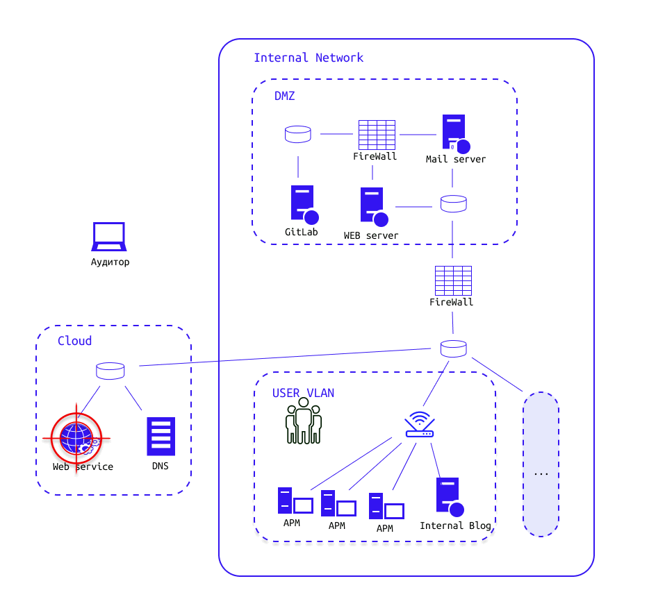

# Lab_1_1 Поиск чувствительных данных компании (OSINT)

### Основные понятия

1. **Разведка по открытым источникам (Open Source Intelligence, OSINT)** — разведывательная дисциплина, включающая в себя поиск, выбор и сбор разведывательной информации из общедоступных источников, а также её анализ.
2. **Разведка в сети** – это процесс сбора информации об объекте или цели в интернете. Это может быть любая информация, которая может помочь в осуществлении дальнейших действий по отношению к объекту, например, определение уязвимостей или сбор данных для атаки.
3. **Инфраструктура компании** — это совокупность аппаратных, программных и сетевых средств, используемых для поддержания бизнес-процессов и обеспечения безопасности информации, находящейся в распоряжении компании. Она включает в себя серверы, сетевые устройства, базы данных, приложения и другие компоненты, используемые для обработки, хранения и передачи данных. Эффективная инфраструктура компании должна быть разработана с учетом требований к безопасности и включать в себя меры защиты, которые обеспечат целостность, конфиденциальность и доступность информации в пределах организации.
4. **Сетевой сканер** — это программа, предназначенная для сканирования компьютерных сетей и обнаружения устройств, портов и служб, работающих на этих устройствах. Они используются для проверки безопасности сетей, выявления уязвимостей и проверки соответствия настроек безопасности определенным стандартам.
5. **Доменное имя** – это уникальное текстовое имя, которое используется для идентификации адреса ресурса в Интернете.
6. **DNS (Domain Name System)** – это сервис, который преобразует доменные имена, которые мы используем для поиска ресурсов в Интернете, в соответствующие IP-адреса, по которым эти ресурсы находятся на серверах в сети Интернет.
7. **SSL (Secure Sockets Layer) сертификат** – это цифровой сертификат, который подтверждает подлинность веб-сайта и обеспечивает защищенное соединение между веб-браузером и сервером, на котором расположен веб-сайт. Сертификаты выпускаются специальными доверенными для широкой массы компьютеров удостоверяющими центрами по всему миру, представляют из себя файлы определенного формата, которые располагаются на серверах, для предоставления их пользователям и проверки легитимности сервисов.
8. **Сетевой порт** – это номер, который идентифицирует определенный сетевой протокол и процесс, который использует этот протокол для передачи данных в компьютерных сетях. Когда компьютер или устройство отправляет или получает данные через сеть, оно использует определенный порт для связи с другим устройством или сервером, используя определенный сетевой протокол. Номер порта представляет собой целое число от 0 до 65535.
9. **Хост / узел** – это устройство или программа, которая может быть связана с другими устройствами или программами в компьютерной сети. Узлы сети могут выполнять различные функции, такие, как передача данных, маршрутизация, хранение информации, обработка запросов и т.д. Каждый узел сети имеет свой уникальный адрес, который позволяет другим узлам обращаться к нему и передавать данные. Примерами узлов сети могут быть компьютеры, маршрутизаторы, сетевые принтеры, серверы, мобильные устройства и т.д.

### Процесс сбора информации о внешней инфраструктуре.

Открытые источники информации могут включать в себя интернет-ресурсы, социальные сети, газеты, журналы, телевидение, радио, публичные базы данных и другие источники, которые не требуют специальных разрешений или привилегий для доступа к ним.

Конечная цель сбора информации — получить как можно больше данных, относящихся к целевой компании.

**На какие вопросы мы отвечаем в этом процессе:**

- Действительно ли данная информация (учетные данные, публичные сервисы и сайты, информационные сообщения) относятся к нашей цели, а не к другим компаниям, которые не являются нашими целями?
- С какими сервисами мы сможем взаимодействовать через сеть для того, чтобы изучать их и исследовать их уязвимости: это веб-сайты, почтовые серверы, серверы удаленных рабочих столов?
- Какие бизнес-риски существуют в организации? Какие самые важные места она защищает или имеет?
- Какие технологии использует организация на публичном периметре сети и внутри себя?

### Общие методы и конкретные способы сбора информации

Общие методы сбора информации разделяются на две категории: **активные** и **пассивные**.

**Активные методы сбора информации в открытых источниках** – это методы, которые требуют непосредственного взаимодействия с источником информации, например, с использованием запросов, сканирования портов и опроса сервисов.

Иначе говоря, непосредственный владелец ИТ-инфраструктуры сможет определить применение по отношению к нему активных методов сбора информации, т.к. его системы получат запросы от действующего лица и его программ. При активном методе ваши сетевые запросы приходят прямо от ваших систем на системы владельца, и он может их увидеть.

Примеры активных методов сбора информации включают:
- Сканирование портов – это способ, который позволяет определить, какие порты на серверах компании открыты для доступа извне. Сканирование портов может помочь определить, какие службы доступны на серверах и какая операционная система установлена на серверах.
- Энумерация и предугадывание доменных имен – это способы определения доменных имён, которые используются компанией или организацией. Этот процесс может включать в себя использование различных методов, таких, как перебор имен поддоменов, используемых в названии компании, и различных вариантов доменных зон (например, .com, .org, .net).
- Посещение и анализ сайтов – это способы углубленного анализа сайтов на предмет их функций, используемых ими технологий, поиске отладочной и технической информации о внутренней сети или устройстве ПО организации.
Пассивные методы сбора информации в OSINT – это методы, которые не требуют непосредственного взаимодействия с источником информации, а основываются на анализе открытых источников информации.

**Пассивные методы сбора информации в OSINT** – это методы, которые не требуют непосредственного взаимодействия с источником информации, а основываются на анализе открытых источников информации.

Примеры пассивных методов сбора информации включают:
- Интернет-мониторинг – это процесс отслеживания и анализа информации, публикуемой в онлайн-ресурсах, включая репозитории, блоги, форумы и другие интернет-сайты.
- Анализ открытых баз данных – это процесс сбора информации из открытых баз данных, таких, как государственные реестры, базы данных компаний, справочники и т.д.
- Анализ различных открытых источников, таких, как сайты-агрегаторы утечек данных, сайты, собирающие информацию о изменении DNS имен и историю DNS, сайты, исследующие интернет и опубликованные в нем сервисы.

#### Отсев нерелевантных данных

После применения различных методов и способов сбора информации всю полученную информацию необходимо валидировать. В общем случае белые хакеры предоставляют собранную информацию организации заказчику и выверяют с ней данные, которые действительно останутся в списке всей полученной информации, чтобы не затронуть информационные системы, которые не предполагаются для дальнейшего исследования и тестирования.

Наша цель в типовой инфраструктуре - поиск чувствительных данных на сайте компании

# Задание

> Story: Вы заключили договор на пентест с компанией "Кодовикс" и можете приступать к работам. Для начала стоит провести разведку во внешней сети. 

Необходимо:
1. Скачать образ kali linux
2. Скачать и запустить в консоли `echo "nameserver 127.0.0.1" | sudo tee /etc/resolv.conf`
3. Выполнить пассивный поиск ресурсов организации codovix.ru (методом OSINT)
4. Собрать полезную информацию для следующего этапа пентеста (составить 2 парольных словаря - в которых будут все комбинации из 5 слов с сохранением регистра, без пробелов между словами). Формула размещения для k < n:

5. Составить мини-отчет, где указать использованные подходы и затронутые угрозы безопасности. Отчет должен содержать название уязвимости, описание уязвимости, пример её эксплуатации, рекомендации к устранению

# Теоретические вопросы

- Что такое пентест?
- Что такое OSINT?
- Какие этапы тестирования на проникновение вам известны?
- Объяснить схему типовой инфраструктуры и почему начинаем с WWW?
- Как осуществляется активный метод сбора информации?
- Что является результатом работы белого хакера?

# Материалы для самостоятельного изучения

- [Агрегация](https://osintframework.com/) всех популярных инструментов и ресурсов для OSINT
- [Агрегация](https://github.com/jivoi/awesome-osint) всех популярных статей, исследований, кейсов и инструментов в OSINT
- [Взгляд со стороны организации](https://habr.com/ru/companies/tensor/articles/706656/) на целесообразность создания процесса киберразведки в собственной системе
