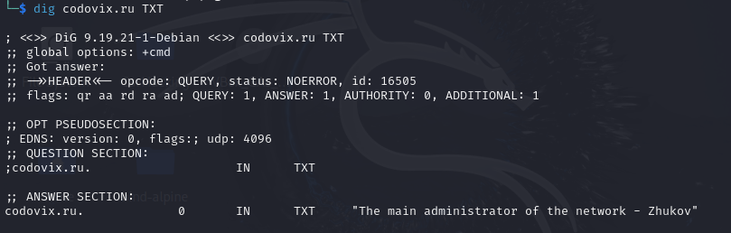

1. Использовать инструменты поиска информации в домене:
 
	- dig codovix.ru TXT
 	- nslookup -type=txt codovix.ru
 	- host -t txt codovix.ru

2. Найти запись, которую забыли стереть разработчики
	
	

3. Теперь достоверно известно какой словарь паролей нужно составлять - тот, который относится к сотруднику Жукову