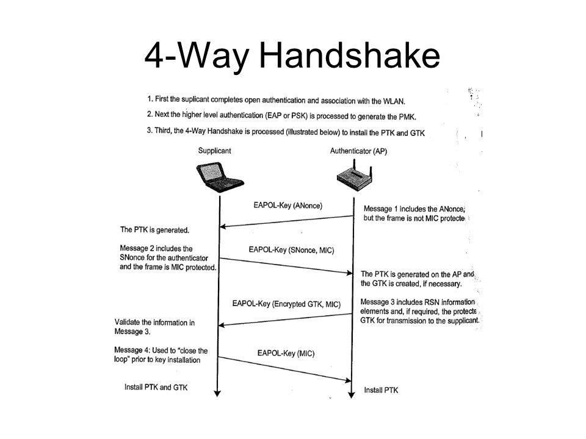

# Lab_2 Атака на беспроводные сети WiFi 802.11

### Основные понятия

1. **Wi-Fi (или беспроводная локальная сеть)** основана на наборе стандартов, известных как семейство стандартов IEEE 802.11. Эти стандарты определяют протоколы и процедуры, которые позволяют беспроводным устройствам обмениваться данными через радиочастотный спектр.
2. **Беспроводная точка доступа (Access Point)** - беспроводная точка доступа (ТД AP) является центральным устройством в беспроводной сети. Она создает беспроводную среду, в которой устройства могут обмениваться данными. Точка доступа подключается к проводной сети и обеспечивает беспроводную связь с устройствами, такими как ноутбуки, смартфоны, планшеты и другие Wi-Fi-совместимые устройства.
3. **Клиентские устройства** - клиентские устройства, такие как ноутбуки, смартфоны или планшеты, являются конечными устройствами, которые подключаются к беспроводной точке доступа. Они используют беспроводной адаптер (Wi-Fi адаптер), чтобы установить связь с точкой доступа и обмениваться данными.
4. **Радиочастотный спектр** Wi-Fi работает в определенном диапазоне радиочастот, который регулируется правительственными организациями. Стандарты Wi-Fi (например, 802.11b/g/n/ac/ax) определяют различные частотные диапазоны, такие как 2,4 ГГц и 5 ГГц, на которых устройства могут взаимодействовать.
5. **Беспроводная Wi-Fi карта (или беспроводной Wi-Fi адаптер)** – любая сетевая карта, способная подключаться к сети Wi-Fi. В ноутбуках и телефонах они встроены внутрь корпуса, в настольных компьютерах обычно представляют собой внешнее устройство, подключаемое по USB.
6. **Режим монитора (Monitor Mode)** – свойство некоторых беспроводных адаптеров принимать пакеты данных, которые предназначены не только для них, но и для других беспроводных устройств.
7. **Сетевой интерфейс** – имя, условное обозначение в Linux сетевых карт/адаптеров.
8. **Каналы** - в радиочастотном спектре Wi-Fi доступны различные каналы. Устройства Wi-Fi могут выбирать каналы для установления связи с точкой доступа. Оптимальный выбор каналов помогает избежать помех от других беспроводных устройств.
9. **Протоколы и процедуры**: Wi-Fi стандарты определяют протоколы и процедуры для установления связи, аутентификации, шифрования данных и управления сетью. Например, протоколы как WPA2 (Wi-Fi Protected Access 2) и WPA3 обеспечивают безопасность Wi-Fi сети путем шифрования данных. WPA2 и WPA3 – технологии защищённого доступа к Wi-Fi, пришли на смену устаревшим технологиям WEP, WPA.
10. **ESSID и SSID** – это имена беспроводных Wi-Fi сетей – именно их вы видите, когда выбираете к какой сети подключиться. Строго говоря, ESSID и SSID это не одно и то же, но в аудите Wi-Fi эти термины часто используются как взаимозаменяемые. На скриншоте ниже ESSID (именами сетей) являются MiAl, wifi88 и т.д.:
11. **BSSID** – это MAC-адрес беспроводной карты. Пример MAC-адреса: 50:46:5D:6E:8C:20. Более подробно о них рассказано в заметке «Как узнать MAC-адрес и Как по MAC-адресу узнать производителя».
12. **Рукопожатие (также хэндшейк, handshake)** – данные, которыми обмениваются Станция и Точка Доступа в момент создания Wi-Fi соединения. Эти данные содержат информацию, позволяющую подобрать пароль от сети Wi-Fi.
13. **Онлайн перебор пароля Wi-Fi** – метод подбора пароля, который заключается в подключении к Точке Доступа с различными кандидатами в пароли. Практически не применяется из-за крайне низкой скорости перебора. Преимущества этого метода — не требуется беспроводной адаптер с поддержкой режима монитора. Недостаток — этот метод крайне медленный.
14. **Офлайн перебор пароля Wi-Fi** – метод подбора пароля, который заключается в захвате Рукопожатия и подборе такого пароля, который бы соответствовал этому рукопожатию. Этот подбор не требует подключения к Точке Доступа и выполняется на много порядков быстрее, чем онлайн перебор. Также он может выполняться на вычислительных мощностях видеокарт, что увеличивает скорость перебора ещё на несколько порядков.
15. **Сарtivе портал** - страница авторизации пользователя в сети WiFi  
16. **Brute Force по словарю** - Тестирование нескольких паролей из словаря или другого источника для одной учетной записи. Имеет хорошее соотношение затраченных ресурсов к полученным результатам.
17. **Классический Brute Force** - (также полный перебор) – метод атаки на пароль, заключающийся в переборе всех возможных вариантов пароля. Требует много времени и вычислительных ресурсов.
18. **Credential Stuffing** - Тестирование пар логин/пароль, полученных в результате взлома другого ресурса
19. **Password Spraying** - Тестирование одного слабого пароля для большого количества различных учетных записей

### Основные компоненты и принципы работы Wi-Fi следующие:

Общение между беспроводной точкой доступа и клиентскими устройствами происходит через радиосигналы, которые передаются в виде пакетов данных. Wi-Fi использует различные методы модуляции и демодуляции сигналов для передачи информации по радиочастотам.

### Теория

#### Каналы

### Процесс сбора информации о точке доступа

1. Необходимо настроить свое "рабочее место" - загрузить linux с live образа флешки или иметь Linux установленной ОС на ПК.
2. Также поднадобится сетевая Wi-Fi карта, которая поддерживает режим монитора. В установленных на ноутбуках сетевых картах проблем никогда не возникало. Но для некоторых атак, типа Evil Twin или если запускать linux как виртуальную машину (а не как описано в п.1), то необходимо купить внешнюю сетевую карту Wi-Fi. Также внешняя сетевая карта будет полезна для лучшей эффективности атак, так как они отличаются большей дальностью приема и передачи сигнала, чем те которые предустановлены в ноутбуках и мобильных. Соответственно улучшается покрытие и скорость атаки на клиента, так как часто атака происходит на дальшем расстоянии от точки, чем находится клиент важно иметь более сильный "передатчик". [Список актуальных карт](https://hackware.ru/?p=3328)
  
  

  
Шутка про антенны

  
  

3. Перевод Wi-Fi адаптера в режим монитора
	
 	По умолчанию беспроводные адаптеры находятся в «управляемом» (managed) режиме. Этот режим позволяет подключаться к Точке Доступа в качестве обычного Клиента.
	Режим монитора (monitor) предназначен для анализа Wi-Fi сетей. В этом режиме беспроводная карта принимает фреймы (их ещё называют кадры) от любых источников, находящихся на том же канале.
	Поскольку нам нужно захватить рукопожатие, которое состоит из данных, которые Станция отправляет Точке Доступа и Точка Доступа отправляет Станции (т.е. которые ни на каком этапе не предназначены для нас), то нам необходимо перевести нашу Wi-Fi карту в режим монитора, чтобы она была способна увидеть эти данные и сохранить их для дальнейшей обработки.
4. Запускаем любой сканер wifi (например wash -i wlan0)
5. Собираем значение BSSID точек доступа
6. Захват WPA Handshake - одна из самых популярных и широкоприменяемых атак.
	
 	WPA Handshake передается клиентом во втором сообщении (EAPOL М2) четырехступенчатого рукопожатия. Содержимое этого пакета является доказательством для точки доступа, что клиент знает общий ключ РSК. Злоумышленник же, перехватив такой хеш, может подобрать пароль перебором по словарю. Для захвата этого хеша злоумышленнику не обязательно совершать активные действия, но можно ускорить процесс через деаутентификацию клиентов конкретной точки доступа. Рассылка пакетов деаутентификации отправляет от имени клиента и точки доступа всем слышимым клиентам Wi-Fi сети специальные пакеты, закрывающие соединение (деаутентификация). Клиент, который на самом деле не собирался отключаться от точки доступа, выполнит повторное подключение, передав хеш пароля к этой сети. Деаутентификация имеет негативные побочные воздействия на атакуемую сеть - постоянные отключения клиентов.
	> Стоит упомянуть, что есть вероятность захвата невалидного пароля, который также отправляется в виде пакетов handshake. Но handshake с таким паролем не содержит ответа от точки доступа (EAPOL МЗ), и считается половинчатым (Half-handhake). Чтобы не получить ложного срабатывания, необходимо отбрасывать такие handshakes и оставлять только те, которые имеют подтверждение, а значит, с правильным паролем. 

https://telegra.ph/Vzlom-WiFi-08-17

### Общие методы и конкретные способы атак на точку доступа

#### И тактики

https://attack.mitre.org/techniques/T0860/

Точка доступа WiFi может быть уязвима к **атакам на пользователя** и к **атакам без его участия**. Вот несколько примеров уязвимостей и соответствующих атак:

**Атаки на пользователя**

- Атаки на пользователя:
	1. Перехват трафика: Злоумышленник может использовать инструменты, такие как "отравление кеша ARP" или "перехват пакетов", для перехвата и анализа сетевого трафика, передаваемого через беспроводную точку доступа.
 	2. Атаки на хендшейк:
  	3. DOS - Атаки "отравление кеша ARP" (ARP poisoning): Злоумышленник может использовать эту атаку для подмены ARP-таблицы (Address Resolution Protocol) в беспроводной сети. Это может позволить злоумышленнику перехватывать или изменять сетевой трафик между подключенными пользователями и точкой доступа, а также осуществлять атаки "Man-in-the-Middle" (MITM).
  	4. Атаки "Man-in-the-Middle" (MITM): В атаках MITM злоумышленник позиционирует себя между точкой доступа и пользователями, чтобы перехватывать и изменять их сетевой трафик. Это может позволить злоумышленнику перехватывать конфиденциальные данные, такие как пароли или сессионные куки, или проводить другие атаки на пользователя.
  	5. Атаки на протоколы шифрования: Если беспроводная сеть использует уязвимые протоколы шифрования или слабые ключи, злоумышленник может проводить атаки на шифрование, такие как атаки на WEP или атаки на WPA/WPA2 с использованием слабых паролей или словарей.
  	6. Атаки на пароль или аутентификацию: Злоумышленник может использовать атаки на пароль, такие как словарные атаки, брутфорс или атаки на слабые пароли, для получения доступа к точке доступа или к учетным записям пользователей.
  	7. Атаки на уровне сеанса: Злоумышленник может попытаться атаковать сеанс связи между пользователем и точкой доступа, например, путем перехвата истории сеансов, подбора сессионных идентификаторов (Session ID) или подделки сессионных файлов.
  	8. Атаки на физический уровень: Злоумышленник может попытаться физически вмешаться в работу беспроводной сети, например, путем блокировки или смещения сигнала WiFi или использования устройств, которые могут нарушить работу сети или перехватывать трафик.
  	9. Социальные атаки:
    		- фейк точка доступа
    		- понижение защиты точки доступа

Обход аутентификации WLAN – Общий ключ, фильтрация MAC, скрытые SSID
Взлом шифрования WLAN – WEP, WPA/WPA2 для личных и корпоративных пользователей, понимание уязвимостей на основе шифрования (WEP, TKIP, CCMP)
Атака на инфраструктуру WLAN - Устройства–мошенники, Злые близнецы, DoS-атаки, MITM, настройка защиты Wi-Fi
Продвинутые корпоративные атаки – 802.1x, EAP, LEAP, PEAP, EAP-TTLS
Атака на беспроводного клиента – Приманки и атаки на точки доступа, Caffe-Latte, Hirte, сети Ad-Hoc и вирусные SSID, WiFishing
PMKID Attack (WPA/WPA2)
ARP Request Replay Attack (WEP) 
Hitre Attack (WEP)
Все сети FragAttack

WEP, TKIP, CCMP, silentbridge, fenrir
4. Wordlists
5. Post-Exploitation
6. Evil-Twin

**Атаки которые могут проводиться без подключенных к точке пользователей** - 

- Атаки которые могут проводиться без подключенных к точке пользователей:
    1. Атаки на уровне протоколов: Некоторые уязвимости в самом протоколе Wi-Fi (например, WEP) могут быть использованы для атаки на точку доступа без активного участия пользователя.
    2. Уязвимости в программном обеспечении: Если точка доступа работает на уязвимом программном обеспечении или не обновлена до последней версии, злоумышленник может эксплуатировать уязвимости в программном обеспечении для получения несанкционированного доступа.
    3. WPS PIN - атака на аутентификацию точки доступа;
	> Наиболее уязвимые точки доступа с включенным WPS стоит отбирать по следующим параметрам: 
	> 1. Lck No
	> 2. меньшим dBm
	> 3. WPS 1.0
	> 4. Realtek
    5. frag
    6. Атаки на пароль: Злоумышленник может использовать словарные атаки, брутфорс атаки или атаки по слабым паролям для получения доступа к точке доступа WiFi
    7. WPA/WPA2 Handshake/Ьruteforce - атака на аутентификацию точки доступа + радужные таблицы https://hackware.ru/?p=13762
    8. Key reinstallation attacks (KRACK) если есть ключ PMKID захват EAPOL M1 и брут
    9. DragonBlood
 
### Примеры инструментов (Examples of tools)

Тактика может быть исполнена на ОС linux с использованием сетевой карты поддерживающей режим монитора и дополнительных утилит:

- Manual:
  - [Bettercap]()
  - [Scapy]()
  - [Wireshark]()
  - [Airmon/Airodump/Aireplay/Aircrack-ng]()
  - [tshark](https://www.wireshark.org/docs/man-pages/tshark.html): For detecting WPS networks and inspecting handshake capture files.
  - [reaver](https://github.com/t6x/reaver-wps-fork-t6x): For WPS Pixie-Dust & brute-force attacks.
  - [bully](): For WPS Pixie-Dust & brute-force attacks.
  - [coWPAtty](): For detecting handshake captures.
  - [pyrit](): For detecting handshake captures.
  - [hashcat](): For cracking PMKID hashes.
- Combines:
  - [Wifite2](https://github.com/derv82/wifite2)  
  - [Airgeddon](https://github.com/v1s1t0r1sh3r3/airgeddon)
  - [WiFi-autopwner](https://github.com/Mi-Al/WiFi-autopwner)
- Only EvilTwin attacks:
  - [EapHammer](https://github.com/s0lst1c3/eaphammer)

### Пример WPS - атака на аутентификацию точки доступа

Атака подбора WPS РIN-кода - еще один пример атаки на точку доступа Wi-Fi, требующей длительного времени. Беспроводных устройств с активным и подверженным к перебору WPS достаточно много: от тех же беспроводных принтеров до корпоративных точек доступа. В случае, если точка доступа не имеет некий стандартный PIN, либо не уязвима к Pixie Dust, позволяющему подобрать РIN-код за несколько попыток (секунд), полный перебор всего пространства РIN-кодов в худшем из сценариев для злоумышленника требует 11ООО попыток. Хорошо, если каждая из попыток пройдет хотя бы за 1 с. В результате, в самом идеальном случае, если точка доступа его не заблокирует, на эту атаку может потребоваться несколько часов

1. запускаем сканер wifi   
  
  wash -i wlan0 
    
  выбираем BSSID           
  начать стоит со сканера сетей с 

  1. Lck No
  2. меньшим dBm
  3. WPS 1.0
  4. Realtek

  запускаем перебор ключей с необходимым BSSID
  reaver -i wlan0 -c 2 -b "BSSID" -K -vv --no-nacks -T .5 -d 3 3

### Пример  Evil Тwin

Атака злой двойник» (Evil Twin) - это имитация беспроводной сети, к которой уже есть доверие. И доверие, в этом случае, у пользователей. Таким образом, Evil Twin - это беспроводная социальная атака, беспроводной фишинг, направленный именно на людей, а не на клиентские устройства. Так как не на все сети Wi-Fi можно выполнить ранее описанные атаки, и пароль злоумышленнику тоже удается подобрать далеко не всегда, то можно спросить этот пароль у самих пользователей, которые часто являются самым слабым звеном периметра. В этом случае настраиваем сетевую карту как точку доступа Wi-Fi с тем же именем сети, что и атакуемая. С той лишь разницей, что сеть является открытой. Атака полагается на факт доверия со стороны пользователя к подставной сети. Предполагается, что именно пользователь намеренно подключится к будто бы легальной беспроводной сети и введет пароль, который отправится прямо к злоумышленнику в открытом виде. Чтобы повысить вероятность того, что кто-то из пользователей подключится к подставной сети, можем отправлять пакеты деаутентификации, отключая всех клиентов от атакуемой беспроводной сети. Для успешности атаки Evil Twin злоумышленнику требуется грамотно решить две задачи: запустить беспроводную сеть с именем, которое точно привлечет внимание людей, и, конечно же, грамотный претекстинг Сарtivе портала. 

### Пример bruteforce WPA handshake

tshark -r WPA2-PSK-Capture1.cap -Y 'eapol'
aircrack-ng -w 1000000-password-seclists.txt -e WiFi-wpa -b bssid WPA2-PSK-Capture1.cap
asleap -C bssid - R bssid -W seclist.txt

Wifi map

https://teletype.in/@r00t_owl/7DwgIB6PbmI
https://book.hacktricks.xyz/generic-methodologies-and-resources/pentesting-wifi
https://hackmd.io/@ka0na5hi/HJRaz91Xd
https://hackware.ru/?p=372
https://github.com/blaCCkHatHacEEkr/PENTESTING-BIBLE
https://hackmd.io/kYAqxmOjTE6-UAv6TubiiA
https://executeatwill.com/2020/01/05/Wireless-Wifi-Penetration-Testing-Hacker-Notes/
https://uceka.com/2014/05/12/wireless-penetration-testing-cheat-sheet/
https://www.hackingloops.com/kick-victims-off-of-wireless-networks/
https://gbhackers.com/wireless-penetration-testing-checklist-a-detailed-cheat-sheet/
https://github.com/duyetdev/bruteforce-database/blob/master/1000000-password-seclists.txt
https://github.com/derv82/wifite2
https://www.freebuf.com/articles/wireless/338334.html
https://wifigid.ru/besprovodnye-tehnologii/tehnologiya-802-11n-wi-fi-4-tsaritsa-wi-fi

https://raw.githubusercontent.com/koutto/pi-pwnbox-rogueap/main/mindmap/WiFi-Hacking-MindMap-v1.png
https://github.com/ivan-sincek/wifi-penetration-testing-cheat-sheet

### Защита

- Использование WPA2/3
- Мониторинг сети на появление новых сетей и подключение к существующим
- Отключить WPS
- Обновить прошивку маршрутизатора и сменить пароль администратора с базового
- Сложные пароли у клиентов
	> Время брутфорса
	> 
- Смена пароля у клиентов раз в 60 дней

Наша цель в типовой инфраструктуре - получение доступа к беспроводной сети WiFi

.png>)

# Задание

1. Скачать архив с дампами трафика в формате pcap.
2. Провести анализ дампов и найти подходящий для атаки `bruteforce WPA handshake по словарю` из найденных в открытых источника данных о сотрудниках.
3. Дополнить отчет, где указать использованные подходы и затронутые угрозы безопасности. Отчет должен содержать название уязвимости, [cvss вектор](https://www.first.org/cvss/calculator/4.0), описание уязвимости, пример её эксплуатации, рекомендации к устранению. Указать найденный пароль. 

# Теоретические вопросы
