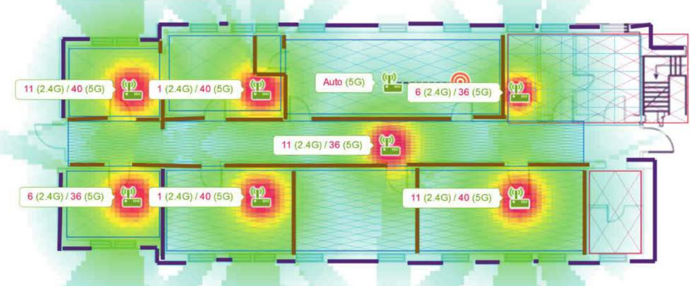
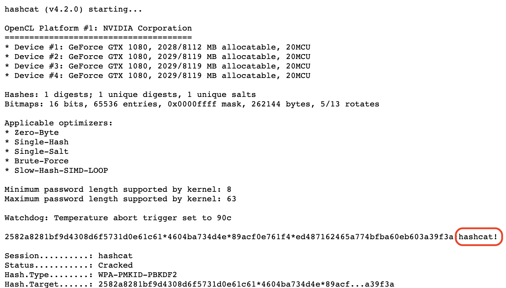

\newpage

# Задание 2.1 Атака на беспроводные сети WiFi 802.11

### Основные понятия

1. **Wi-Fi (или беспроводная локальная сеть)** основана на наборе стандартов, известных как семейство стандартов IEEE 802.11. Эти стандарты определяют протоколы и процедуры, которые позволяют беспроводным устройствам обмениваться данными через радиочастотный спектр.
2. **Беспроводная точка доступа (Access Point)** - беспроводная точка доступа (ТД AP) является центральным устройством в беспроводной сети. Она создает беспроводную среду, в которой устройства могут обмениваться данными. Точка доступа подключается к проводной сети и обеспечивает беспроводную связь с устройствами, такими как ноутбуки, смартфоны, планшеты и другие Wi-Fi-совместимые устройства.
3. **Клиентские устройства** - клиентские устройства, такие как ноутбуки, смартфоны или планшеты, являются конечными устройствами, которые подключаются к беспроводной точке доступа. Они используют беспроводной адаптер (Wi-Fi адаптер), чтобы установить связь с точкой доступа и обмениваться данными.
4. **Радиочастотный спектр** Wi-Fi работает в определенном диапазоне радиочастот, который регулируется правительственными организациями. Стандарты Wi-Fi (например, 802.11b/g/n/ac/ax) определяют различные частотные диапазоны, такие как 2,4 ГГц и 5 ГГц, на которых устройства могут взаимодействовать.
5. **Мощность передатчика (TX) сетевой карты** Значение, которое обозначает с какой мощностью карта может передавать сигнал (как далеко). Выражается в dBm или mW = 10\*log_10(mW). 1 МВт = 1 дБм, 10 МВт = 10 дБм, 100 МВт = 20 дБм, 1 Вт = 30 дБм... Например, Alfa AWUS306H имеет мощность передачи данных = 1000 МВт (30 дБм)
6. **Чувствительность сетевой карты** Значение, которое обозначает насколько хорошо карта может принимать сигнал. Обычно измеряется в дБм. Чем более отрицательное число, тем лучше. Типичные значения чувствительности для средних карт = от -80 до -90 дБм.
7. **Чувствительность антенны** Значение, которое обозначает эффективную дальность действия двойной антенны. Измеряется в dBi.
8. **Беспроводная Wi-Fi карта (или беспроводной Wi-Fi адаптер)** – любая сетевая карта, способная подключаться к сети Wi-Fi. В ноутбуках и телефонах они встроены внутрь корпуса, в настольных компьютерах обычно представляют собой внешнее устройство, подключаемое по USB.
9. **Режим монитора (Monitor Mode)** – свойство некоторых беспроводных адаптеров принимать пакеты данных, которые предназначены не только для них, но и для других беспроводных устройств.
10. **Сетевой интерфейс** – имя, условное обозначение в Linux сетевых карт/адаптеров.
11. **Каналы** - в радиочастотном спектре Wi-Fi доступны различные каналы. Устройства Wi-Fi могут выбирать каналы для установления связи с точкой доступа. Оптимальный выбор каналов помогает избежать помех от других беспроводных устройств.
12. **Протоколы и процедуры**: Wi-Fi стандарты определяют протоколы и процедуры для установления связи, аутентификации, шифрования данных и управления сетью. Например, протоколы как WPA2 (Wi-Fi Protected Access 2) и WPA3 обеспечивают безопасность Wi-Fi сети путем шифрования данных. WPA2 и WPA3 – технологии защищённого доступа к Wi-Fi, пришли на смену устаревшим технологиям WEP, WPA.
13. **ESSID и SSID** – у любой беспроводной сети есть уникальный идентификатор – SSID (service set identifier), который собственно и отображается как имя сети при просмотре списка доступных сетей. Строго говоря, ESSID и SSID это не одно и то же, но в аудите Wi-Fi эти термины часто используются как взаимозаменяемые. 
14. **BSSID** – это MAC-адрес беспроводной карты. Пример MAC-адреса: 50:46:5D:6E:8C:20.
15. **Рукопожатие (также хэндшейк, handshake)** – данные, которыми обмениваются клиент и Точка Доступа в момент создания Wi-Fi соединения. Эти данные содержат информацию, позволяющую подобрать пароль от сети Wi-Fi.
16. **Онлайн перебор пароля Wi-Fi** – метод подбора пароля, который заключается в подключении к Точке Доступа с различными кандидатами в пароли. Практически не применяется из-за крайне низкой скорости перебора. Преимущества этого метода — не требуется беспроводной адаптер с поддержкой режима монитора. Недостаток — этот метод крайне медленный.
17. **Офлайн перебор пароля Wi-Fi** – метод подбора пароля, который заключается в захвате Рукопожатия и подборе такого пароля, который бы соответствовал этому рукопожатию. Этот подбор не требует подключения к Точке Доступа и выполняется на много порядков быстрее, чем онлайн перебор. Также он может выполняться на вычислительных мощностях видеокарт, что увеличивает скорость перебора ещё на несколько порядков.
18. **Сарtivе портал** - страница авторизации пользователя в сети WiFi  
19. **Brute Force по словарю** - Тестирование нескольких паролей из словаря или другого источника для одной учетной записи. Имеет хорошее соотношение затраченных ресурсов к полученным результатам.
20. **Классический Brute Force** - (также полный перебор) – метод атаки на пароль, заключающийся в переборе всех возможных вариантов пароля. Требует много времени и вычислительных ресурсов.
21. **Credential Stuffing** - Тестирование пар логин/пароль, полученных в результате взлома другого ресурса
22. **Password Spraying** - Тестирование одного слабого пароля для большого количества различных учетных записей

### WiFi - Wireless Fidelity

WiFi - это промышленное название технологии беспроводного обмена данными, относящееся к группе стандартов организации беспроводных сетей IEEE 802.11. В некоторой степени, термин Wi-Fi является синонимом 802.11b, поскольку стандарт 802.11b был первым в группе стандартов IEEE 802.11 получившим широкое распространение. Однако сегодня термин Wi-Fi в равной степени относится к любому из стандартов 802.11b, 802.11a, 802.11g и 802.11n, 802.11ac.


Wi-Fi Alliance занимается аттестацией Wi-Fi продукции, что позволяет гарантировать, что вся 802.11 продукция, поступающая на рынок, соответствует спецификации стандарта. К сожалению, стандарт 802.11a, использующий частоту 5ГГц, не совместим со стандартами 802.11b/g, использующим частоту 2,4ГГц, поэтому рынок Wi-Fi продукции остается фрагментиро-
ванным. Для нашей страны это неактуально, поскольку для использования аппаратуры стандарта 802.11а, требуется специальное разрешение и она не получила широкого распространения, к тому же подавляющее большинство устройств, поддерживающих стандарт 802.11a, поддерживают также и стандарт 802.11b или 802.11g, что позволяет считать относительно совместимыми все продаваемые в данный момент WiFi устройства. Новый стандарт 802.11n поддерживает обе эти частоты.

### Основные компоненты и принципы работы Wi-Fi следующие:

Общение между беспроводной точкой доступа и клиентскими устройствами происходит через радиосигналы, которые передаются в виде пакетов данных. Wi-Fi использует различные методы модуляции и демодуляции сигналов для передачи информации по радиочастотам.

Радиус действия со штатными антеннами (обычно усиление 2dBi) популярных точек доступа и маршрутизаторов стандарта 802.11g, при условии, что они соединяются с устройством, имеющим антенну с аналогичным усилением, можно примерно оценить в 150м на открытой местности и 50 м в помещении, более точные цифры для разных стандартов приведены ниже в таблице, посвященной скорости передачи.

Препятствия в виде кирпичных стен и металлических конструкций могут уменьшить радиус действия Wi-Fi сети на 25% и более. Поскольку стандарты 802.11a/ac используют частоты выше, чем стандарты 802.11b/g, он является наиболее чувствительным к различного рода препятствиям. На радиус действия Wi-Fi сетей, поддерживающих стандарт 802.11b или 802.11g, влияют также помехи, исходящие от микроволновых печей. Ниже показана таблица с приблизительными потерями эффективности сигнала Wi-Fi с частотой 2.4 ГГц при прохождении через различные препятствия.

|Тип препятствия| Дополнительные потери (dB)|  Эффективное расстояние|
| --- | --- | --- | 
|Открытое пространство| 0| 100%|
|Окно без тонировки <br> (отсутствует метализированное покрытие) | 3| 70%|
|Окно с тонировкой <br> (метализированное покрытие)| 5-8| 50%|
|Деревянная стена | 10|  30%|
|Межкомнатная стена <br> (15,2 см) | 15-20| 15%|
|Несущая стена <br> (30,5 см)| 20-25 |10-15%|
|Бетонный пол/потолок | 15-25 |10-15%|
|Монолитное железобетонное<br>  перекрытие | 20-25| 10%|

Ещё одним существенным препятствием может оказаться листва деревьев, поскольку она содержит воду, поглощающую микроволновое излучение данного диапазона. Проливной дождь ослабляет сигналы в диапазоне 2.4GHz с интенсивностью до 0.05 dB/км, густой туман вносит ослабление 0.02 dB/км, а в лесу (густая листа, ветви) сигнал может затухать с интенсивностью до 0.5дб/метр.

Увеличить радиус действия Wi-Fi сети можно посредством объединения в цепь нескольких беспроводных точек доступа или маршрутизаторов, а также путём замены штатных антенн, установленных на сетевых картах и точках доступа, на более мощные.

Существует несколько стандартов 802.11

|Протокол|  Используемая частота|  Максимальная теоретическая скорость| Типичная скорость на практике| Дальность связи в помещении| Дальность связи на открытой местности|
|---|---|---|---|---|---|
|802.11b| 2.4ГГц  |11Мбит/cек  | 0.4Мбайт/cек|  38|  140
|802.11a| 5ГГц  |54Мбит/cек  | 2.3Мбайт/cек|  35|  120
|802.11g| 2.4ГГц  |54Мбит/cек  | 1.9Мбайт/сек|  38|  140
|802.11n| 2.4ГГц, 5ГГц|  600Мбит/cек|  7.4Мбайт/cек|  70|  250

Максимальную пропускную способность могут предложить сети, поддерживающие стандарт 802.11ac - до 2167 Мбит/сек

### Безопасность, шифрование и авторизация пользователей в беспроводных сетях.

Изначально для обеспечения безопасности в сетях 802.11 применялся алгоритм **WEP(Wired Equivalent Privacy)**, включавший в себя алгоритм шифрования RC4 c 40-битным или 104-битным ключом и средства распределения ключей между пользователями, однако в 2001 году в нём была найдена принципиальная уязвимость, позволяющая получить полный доступ к сети за конечное (и весьма небольшое время) вне зависимости от длины ключа. Категорически не рекомендуется к использованию в настоящее время. Поэтому в 2003 году была принята программа сертификации средств беспроводной связи под названием **WPA(Wi-Fi Protected Access)**, устранявшая недостатки предыдущего алгоритма. С 2006 года все WiFi-устройства обязаны поддерживать новый стандарт **WPA2**, который отличается от WPA поддержкой более современного алгоритма шифрования AES с 256-битным ключом. Также в WPA появился механизм защиты передаваемых пакетов с данными от перехвата и фальсификации. Именно такое сочетание (WPA2/AES) рекомендуется сейчас к использованию во всех закрытых сетях. **WPA3** – это самый новый и современный стандарт безопасности для защиты Wi-Fi сетей. Он обеспечивает более надежную защиту, обеспечивает лучшее шифрование паролей и более устойчив к брутфорс‑атакам (попыткам подобрать пароль). Так же новый стандарт позволяет упростить подключение новых устройств. [WPA3](https://habr.com/en/articles/424925/) был представлен в 2018 году. Главное преимущество по сравнению с WPA2 – это использование метода SAE (Simultaneous Authentication of Equals) вместо TKIP/AES. Именно он дает усиленную защиту от брутфорс‑атак. Это максимальная защита именно в процессе соединения между устройствами. Это особенно актуально в том случае, когда установлен простой, ненадежный пароль Wi-Fi сети. Метод WPA3-Enterprise получил шифрование с длиной ключа 192 бит. По сравнению с 128-битным шифрованием в WPA2. Поддержка протокола Enhanced Open. Улучшенная безопасность открытых общественных сетей благодаря методу шифрования Opportunistic Wireless Encryption (OWE). Упрощённый и более надёжный процесс подключения IoT‑устройств благодаря Easy Connect. В первую очередь речь идет об устройствах умного дома и устройствах без дисплеев (когда нет возможности удобно ввести пароль), реализуется через подключение устройств с помощью QR-кода.

| |WEP|WPA|WPA2|WPA3
|---|---|---|---|---|
|Протокол шифрования|Алгоритм RC4 с ручным назначением ключей|Протокол TKIP, основанный на RC4|Протокол CCMP с ключами AES длиной 128 бит|Протокол SAE с ключами PK длиной 128 бит
|Целостность данных|Линейная хэш-функция|Криптографическая хэш-функция|Криптографическая хэш-функция|Криптографическая хэш-функция
|Управление ключами|Нет|Да|Да|Да
|Обнаружение атак типа replay|Нет|Да|Да|Да

У WPA есть два режима авторизации пользователей в беспроводной сети - WPA/WPA2-Enterprise при помощи RADIUS-сервера авторизации (ориентирован на корпоративных пользователей и крупные сети, в этом материале не рассматривается) и WPA/WPA2-Personal при помощи WPA-PSK(Pre Shared Key), который предлагается использовать в домашних сетях, а также в небольших офисах. В этом режиме авторизация по паролю (длиной от 8 до 64 символов) производится на каждом узле сети.

Возможности беспроводных сетей, работающих в режимах WPA/WPA2-Personal/Enterprise 

|WPA/WPA2-Personal|WPA/WPA2-Enterprise|
|---|---|
|Централизованно неуправляемый режим аутентификации на основе PSK (используется вводимая вручную парольная фраза, общая для всех пользователей сети)|Каждому пользователю назначаются индивидуальные права доступа после IEEE 802.1X-аутентификации |
|Не требуется сервер аутентификации|Требуется сервер аутентификации IEEE 802.1X ААА с поддержкой ЕАР и база аутентификационных данных|
|Ключи шифрования данных уникальны для каждой сессии|Ключи шифрования данных уникальны для каждой сессии

- `Beacon Frame` = Анонсирование от ТД включает информацию о поддерживаемых тарифах точки доступа, возможностях шифрования ...)
- `Probe Request` = Кадр, отправленный станцией, ищущей точку доступа. 2 типа запросов `Probe Requests`:
	- `Directed Probe Request` = Клиент ищет определенный известный SSID. Может использоваться злоумышленником для поиска скрытого SSID или для восстановления PNL клиента ("Мой WiFi здесь?").
	- `Broadcast Probe Request` = Широковещательный запрос клиента для проверки наличия поблизости какой-либо беспроводной сети ("Есть ли здесь Wi-Fi?").
- `Probe Response` = Кадр, отправляемый точкой доступа на станцию при ответе на запрос `Probe Request`. Содержит аналогичную информацию, что и `Beacon Frames`.
- `Authentication Request` = Станция инициирует аутентификацию с точкой доступа.
- `Association Request` = После аутентификации станция запрашивает ассоциацию с точкой доступа.
- `Deauthentication Request` = Отправляется точкой доступа клиенту для его отключения. Может быть отправлен злоумышленником для попытки отключить клиент.
- `Disassociation Request` = Отправляется точкой доступа клиенту. В отличие от запроса на деаутентификацию, отключение обычно отправляется клиенту при отключении / перезагрузке точки доступа. Злоумышленник также может отправить запрос такого типа вместе с запросом деаутентификации, чтобы увеличить шансы на успешное отключение клиента.


`PSK` = Единственная фраза-пароль, используемая для аутентификации:

- Доступна для всех устройств и точки доступа.
- Длина PSK между 8 и 63 символами

`PMK` = Попарный мастер-ключ. Генерируется клиентом и точкой доступа перед 4-сторонним рукопожатием:

- `PMK = PBKDF2(HMAC−SHA1, PSK, SSID, 4096, 256)`
- HMAC-SHA1 - используемая псевдослучайная функция.
- 4096 итераций (защита от перебора, который отнимает много времени)
- PMK - это 256 бит


`PTK` = Парные переходные ключи. Генерируется как клиентом, так и точкой доступа во время 4-стороннего рукопожатия.

```bash
PTK = Hash(PMK||ANonce||SNonce||MAC_AP||MAC_Client)
```

- PTK используется для шифрования данных между клиентом и точкой доступа
- Меняется по крайней мере каждые 65535 пакетов
- PTK 64-разрядный
- PTK разделен следующим образом:
	- 16 байт (128 бит) `Key Confirmation Key` (KCK). Используется для вычисления MIC на предмет целостности.
	- `Key Encryption Key` 16 байт (KEK). Используется для шифрования дополнительных данных, передаваемых от точки доступа клиентам во время установления связи.
	- `Temporal Key` (TK) размером 16 байт. Используется для шифрования / дешифрования сообщений после рукопожатия.
	- 8-байтовый ключ `MIC Authenticator Tx` (MIC Tx). Используется для вычисления MIC в пакетах, передаваемых точкой доступа.
	- 8-байтовый `Rx-ключ MIC Authenticator` (MIC Rx). Используется для вычисления MIC в пакетах, передаваемых клиентом.

|128 bits | 128 bits | 128 bits | 64 bits | 64 bits |
|---|---|---|---|---|
|    KCK    |     KEK    |     TK     |  MIC Tx   |   MIC Rx  |

WPA-handshake прилетает от клиента во втором пакете рукопожатия (EAPOL М2). Задача атакующего - набрать таких handshake, используя подвижность или неприметность. После чего набранные handshake могут быть подвергнуты брутфорсу. Подробнее атака будет описана ниже.


Благодаря полученному 2-му пакету EAPol для рукопожатия достаточно информации, чтобы попытаться вычислить PTK (используя предполагаемую кодовую фразу PSK), которую затем можно использовать для извлечения KCK и вычисления MIC (HMAC_MD5). Этот недавно вычисленный MIC сравнивается с захваченным MIC, чтобы определить достоверность предполагаемого PSK.

> Примечание: Если есть желание понять, как работает аутентификация с сервером RADIUS в корпоративных сетях по стандарту 802.1X, то читайте в приложенных материалах главу 3.3.1 Технологии современных беспроводных сетей Wi-Fi.pdf под общей редакцией А.В. Пролетарского и поможет [конспект исследователя](https://github.com/koutto/pi-pwnbox-rogueap/wiki/07.-WPA-WPA2-Enterprise-(MGT)) Jérémy Brun-Nouvion 

Также во многих современных бытовых Wi-Fi устройствах применяется режим **Wi-Fi Protected Setup (WPS)**, также именуемый Wi-Fi Easy Setup, где авторизация клиентов на точке доступа осуществляется при помощи специальной кнопки или вводом 8-ми значного pin-кода, уникального для устройства. Один из самых быстрых способов взлома точки доступа это перебор WPS-ключей и перебор WPS-ключей для конкретного производителя.

Для случаев, когда в сети эксплуатируется фиксированный набор оборудования (т.е. например, мост, созданный при помощи двух точек доступа или единственный ноутбук, подключаемый к беспроводному сегменту домашней сети) минимально надёжным способом является ограничение доступа по MAC-адресу (уникальный адрес для каждого Ethernet устройства, как проводного, так и беспроводного) посредством прописывания в меню точки доступа списка MAC-адресов «своих» устройств и выбор разрешения доступа в сеть только устройствам с адресами из этого списка. Минимально надежным по той причине, что атакующий может подменить свой MAC-адрес на адрес жертвы, предварительно отключив жертву от сети. 


По MAC-адресу можно узнать производителя, для этого есть удобные сервисы: https://2ip.ru/mac-address/

При отключении рассылки (broadcast) SSID сеть будет выглядеть для просматривающих доступные сети пользователей как безымянная, а для подключения необходимо знать и SSID, и пароль (в случае использования WPA-PSK), однако само по себе отключение SSID не делает сеть более устойчивой к несанкционированному проникновению извне.

### Частота Wi-Fi 2,4 ГГц и 5 ГГц

|Параметры|2,4 ГГц |5 ГГц
|---|---|---|
|Каналов|11|45
|Скорость| до 650 Мбит/с| до 1300 Мбит/с
|Каналы |Перекрываются друг с другом и создают помехи, кроме 1, 6, 11 |24 неперекрывающихся
|Пропускная способность|Лучше, потому что более низкие частоты легче проникают сквозь твердые объекты|Низкая в помещении
|Помехи|Возможны, например, из-за Bluetooth|Очень мало помех, не связанных с Wi-Fi
|Совместимость|Универсальная: 802.11 b/g/n|Ограниченная: 802.11 a/n/ac

### Каналы 

Когда клиент 802.11 попадает в зону действия одной или нескольких точек доступа, он на основе мощности сигнала и наблюдаемого значения количества ошибок выбирает одну из них и подключается к ней. Как только клиент получает подтверждение того, что он принят точкой доступа, он настраивается на радиоканал, в котором она работает. Время от времени он проверяет все каналы 802.11, чтобы посмотреть, не предоставляет ли другая точка доступа в инфраструктуре службы более высокого качества. Если такая точка доступа находится, то клиент подключается к ней, перенастраиваясь на её частоту

Есть выделенные диапазоны радиочастот. 


Для лучшего использования они поделены на отдельные куски, которые называются каналами. В зависимости от региона и страны правила их использования могут меняться, поэтому важно, чтобы в настройках как роутера, так и остальных устройств регион был один и тот же. Иногда это определяется по косвенным признакам вроде раскладок клавиатуры, языка интерфейса, часового пояса, параметрам соседних сетей Wi-Fi и так далее. В диапазоне 5 ГГц, вероятнее всего, подойдут только каналы с 36-го по 48-й. Для 2,4 ГГц таких каналов есть 13 штук, но работа Wi-Fi на любом из них влияет и на соседние каналы тоже. Фактически не пересекаются и не мешают друг другу каналы с шагом в пять между собой: 1, 6 и 11. Хуже, но вполне допустимо и такое распределение: 1/4/7/11 или 1/5/9/13. Если же речь идёт о более современных стандартах с удвоенной шириной канала (40 МГц вместо 20 МГц), то места-то и вообще не остаётся: без пересечений будут работать, например, только 3-й и 11-й каналы.



Есть множество утилит для анализа эфира Wi-Fi: inSSIDer Lite, Acrylic Wi-Fi Home.  


### Процесс сбора информации о точке доступа

1. Необходимо настроить свое "рабочее место" - загрузить linux с live образа флешки или иметь Linux установленной ОС на ПК.
2. Также поднадобится сетевая Wi-Fi карта, которая поддерживает режим монитора. В установленных на ноутбуках сетевых картах проблем никогда не возникало. Но для некоторых атак, типа Evil Twin или если запускать linux как виртуальную машину (а не как описано в п.1), то необходимо купить внешнюю сетевую карту Wi-Fi. Также внешняя сетевая карта будет полезна для лучшей эффективности атак, так как они отличаются большей дальностью приема и передачи сигнала, чем те которые предустановлены в ноутбуках и мобильных. Соответственно улучшается покрытие и скорость атаки на клиента, так как часто атака происходит на дальшем расстоянии от точки, чем находится клиент важно иметь более сильный "передатчик". [Список актуальных карт](https://hackware.ru/?p=3328)

3. Перевод Wi-Fi адаптера в режим монитора
	
 	По умолчанию беспроводные адаптеры находятся в «управляемом» (managed) режиме. Этот режим позволяет подключаться к Точке Доступа в качестве обычного Клиента.
	Режим монитора (monitor) предназначен для анализа Wi-Fi сетей. В этом режиме беспроводная карта принимает фреймы (их ещё называют кадры) от любых источников, находящихся на том же канале.

	Поскольку нам нужно захватить рукопожатие, которое состоит из данных, которые клиент отправляет Точке Доступа и Точка Доступа отправляет клиенту (т.е. которые ни на каком этапе не предназначены для нас), то нам необходимо перевести нашу Wi-Fi карту в режим монитора, чтобы она была способна увидеть эти данные и сохранить их для дальнейшей обработки.

  	```bash
  	sudo iw dev
  	```

  	Имя беспроводного интерфейса указано в строке со словом Interface, т.е. `wlan0`. Запоминаем это значение, поскольку в дальнейшем оно нам понадобиться.

  	Режим монитора не является чем-то обычным для операционной системы, поэтому некоторые программы без спроса, молча переводят Wi-Fi адаптер в управляемый режим. Нам это может помешать, поэтому следующими двумя командами мы закрываем программы, которые могут нам воспрепятствовать:

  	```bash
  	sudo ip link set wlan0 down

  	sudo iw wlan0 set monitor control

  	sudo ip link set wlan0 up
  	```

  	>  Примечание: 
  	> Альтернативный способ 
  	> ```bash 
  	> sudo airmon-ng check kill
  	> sudo airmon-ng start wlan0
  	> ```

4. Запускаем любой сканер wifi 

	Например 

	```bash 
	wash -i wlan0 
	или 
	airodump-ng
	```

	Будет выведен похожий список сетей:

	

	Когда вы увидите в списке сеть, которую хотим атаковать, то остановите программу, для этого нажмите CTRL+c.

5. Собираем значение BSSID точек доступа

	Предположим, нас интересует сеть с ESSID (именем) dlink. Как видно из скриншота, её характеристиками являются: BSSID – это 00:1E:58:C6:AC:FB, она использует WPA2, работает на шестом канале. Также ненулевое значение #Data (захваченные данные, отправляемые это ТД) позволяет предположить, что к ней подключена одна или более станций.

6. Проводим атаку на выбранную ТД, с учетом особенности каждой из атак (Описаны ниже)

### Общие методы и конкретные способы атак на точку доступа

[Тактики](https://attack.mitre.org/techniques/T0860/)


Точка доступа WiFi может быть уязвима к **атакам на пользователя** и к **атакам без его участия**. Вот несколько примеров уязвимостей и соответствующих атак:

- **Атаки на пользователя:**
	1. Перехват трафика: Злоумышленник может использовать инструменты, такие как "отравление кеша ARP" или "перехват пакетов", для перехвата и анализа сетевого трафика, передаваемого через беспроводную точку доступа.
 	2. Обход аутентификации WLAN – Общий ключ, фильтрация MAC, скрытые SSID
	3. DOS - Атаки "отравление кеша ARP" (ARP poisoning): Злоумышленник может использовать эту атаку для подмены ARP-таблицы (Address Resolution Protocol) в беспроводной сети. Это может позволить злоумышленнику перехватывать или изменять сетевой трафик между подключенными пользователями и точкой доступа, а также осуществлять атаки "Man-in-the-Middle" (MITM).
	4. Атаки "Man-in-the-Middle" (MITM): В атаках MITM злоумышленник позиционирует себя между точкой доступа и пользователями, чтобы перехватывать и изменять их сетевой трафик. Это может позволить злоумышленнику перехватывать конфиденциальные данные, такие как пароли или сессионные куки, или проводить другие атаки на пользователя.
	5. Атаки на протоколы шифрования: Если беспроводная сеть использует уязвимые протоколы шифрования или слабые ключи, злоумышленник может проводить атаки на шифрование, такие как атаки на WEP или атаки на WPA/WPA2 с использованием слабых паролей или словарей. Взлом шифрования WLAN – WEP, WPA/WPA2 для личных и корпоративных пользователей, понимание уязвимостей на основе шифрования (WEP, TKIP, CCMP)
	6. Атаки на пароль или аутентификацию: Злоумышленник может использовать атаки на пароль, такие как словарные атаки, брутфорс или атаки на слабые пароли, для получения доступа к точке доступа или к учетным записям пользователей.
	7. Атаки на уровне сеанса: Злоумышленник может попытаться атаковать сеанс связи между пользователем и точкой доступа, например, путем перехвата истории сеансов, подбора сессионных идентификаторов (Session ID) или подделки сессионных файлов.
	8. Атаки на физический уровень: Злоумышленник может попытаться физически вмешаться в работу беспроводной сети, например, путем блокировки или смещения сигнала WiFi или использования устройств, которые могут нарушить работу сети или перехватывать трафик. Атака на инфраструктуру WLAN - Устройства–мошенники, Evil Twin, DoS-атаки, MITM, настройка защиты Wi-Fi
	9. 23 июля 2010 года была опубликована информация об уязвимости Hole196 в протоколе WPA2. Используя эту уязвимость, авторизовавшийся в сети пользователь может расшифровывать данные других пользователей, используя свой закрытый ключ. Никакого взлома ключей или брут-форса не требуется
	10. Key reinstallation attacks (KRACK) если есть ключ PMKID захват EAPOL M1 и брут
	11. Социальные атаки:
    	- Приманки и атаки на точки доступа, Caffe-Latte, Hirte, сети Ad-Hoc и вирусные SSID, WiFishing
    	- Понижение защиты точки доступа
	12. Обход аутентификации WPA2/3 через [CVE-2023-52161](https://www.youtube.com/watch?v=o50ttLaMI9Y) позволяет злоумышленнику убедить целевого пользователя подключиться к вредоносной сети Wi-Fi и перехватить его трафик. Взаимодействие с пользователем не требуются, но для успешной атаки нужно находится неподалеку от жертвы и знать SSID корпоративной сети. 
	13. [WPA2/3 PMF Deauthentication, attack on SAE-Public Key](https://archive.conference.hitb.org/hitbsecconf2022sin/session/attacking-wpa3-new-vulnerabilities-and-exploit-framework/)

- **Атаки которые могут проводиться без подключенных к точке пользователей:**
    1. Атаки на уровне протоколов: Некоторые уязвимости в самом протоколе Wi-Fi (например, WEP) могут быть использованы для атаки на точку доступа без активного участия пользователя.
    2. Уязвимости в программном обеспечении: Если точка доступа работает на уязвимом программном обеспечении или не обновлена до последней версии, злоумышленник может эксплуатировать уязвимости в программном обеспечении для получения несанкционированного доступа.
    3. WPS PIN - атака на аутентификацию точки доступа;
    4. FragAttack
    5. Атаки на пароль: Злоумышленник может использовать словарные атаки, брутфорс атаки или атаки по слабым паролям для получения доступа к точке доступа WiFi
    6. WPA/WPA2 Handshake/Ьruteforce - атака на аутентификацию точки доступа + [радужные таблицы](https://hackware.ru/?p=13762)
    7. DragonBlood
    8. Продвинутые корпоративные атаки направлены на обход 802.1x, EAP, LEAP, PEAP, EAP-TTLS
 
### Примеры инструментов

Тактика может быть исполнена на ОС linux с использованием сетевой карты поддерживающей режим монитора и дополнительных утилит:

- Manual:
	- [Bettercap](https://www.bettercap.org/)
	- [Scapy](https://scapy.net/)
	- [Wireshark](https://www.wireshark.org/download.html)
	- [Airmon/Airodump/Aireplay/Aircrack-ng](https://help.ubuntu.ru/wiki/wi-fi_sniffing)
	- [tshark](https://www.wireshark.org/docs/man-pages/tshark.html): For detecting WPS networks and inspecting handshake capture files.
	- [reaver](https://github.com/t6x/reaver-wps-fork-t6x): For WPS Pixie-Dust & brute-force attacks.
	- [bully](https://github.com/kimocoder/bully): For WPS Pixie-Dust & brute-force attacks
	- [coWPAtty](https://www.willhackforsushi.com/?page_id=50): For detecting handshake captures.
	- [pyrit](https://github.com/JPaulMora/Pyrit?ysclid=lu5p4bilc8619257882): For detecting handshake captures.
	- [hashcat](https://hashcat.net/hashcat/): For cracking PMKID hashes.
	- [WiFi framework](https://github.com/domienschepers/wifi-framework): For KRACK, PMF Deauthentication, attack SAE-Public Key, FragAttack
	- [KRACK-scripts](https://github.com/vanhoefm/krackattacks-scripts): For KRACK
- Combines:
	- [Wifite2](https://github.com/derv82/wifite2)
	- [Airgeddon](https://github.com/v1s1t0r1sh3r3/airgeddon)
	- [WiFi-autopwner](https://github.com/Mi-Al/WiFi-autopwner)
- Only EvilTwin attacks:
	- [EapHammer](https://github.com/s0lst1c3/eaphammer)

### Пример WPS - атака на аутентификацию точки доступа

Атака подбора WPS РIN-кода - еще один пример атаки на точку доступа Wi-Fi, требующей длительного времени. Беспроводных устройств с активным и подверженным к перебору WPS достаточно много: от тех же беспроводных принтеров до корпоративных точек доступа. В случае, если точка доступа не имеет некий стандартный PIN, либо не уязвима к Pixie Dust, позволяющему подобрать РIN-код за несколько попыток (секунд), полный перебор всего пространства РIN-кодов в худшем из сценариев для злоумышленника требует 11ООО попыток. Хорошо, если каждая из попыток пройдет хотя бы за 1 с. В результате, в самом идеальном случае, если точка доступа его не заблокирует, на эту атаку может потребоваться несколько часов

1. запускаем сканер wifi   
  
	```bash
	wash -i wlan0
	```
    
2. выбираем BSSID           
  
	Начать стоит с сетей, которые 

	1. Lck No
	2. меньшим dBm
	3. WPS 1.0
	4. Realtek

3. запускаем перебор ключей с необходимым BSSID

	```bash
	reaver -i wlan0 -c 2 -b "BSSID" -K -vv --no-nacks -T .5 -d 3 3
	```

### Пример Evil Тwin

Атака злой двойник» (Evil Twin) - это имитация беспроводной сети, к которой уже есть доверие. И доверие, в этом случае, у пользователей. Таким образом, Evil Twin - это беспроводная социальная атака, беспроводной фишинг, направленный именно на людей, а не на клиентские устройства. Так как не на все сети Wi-Fi можно выполнить ранее описанные атаки, и пароль злоумышленнику тоже удается подобрать далеко не всегда, то можно спросить этот пароль у самих пользователей, которые часто являются самым слабым звеном периметра. В этом случае настраиваем сетевую карту как точку доступа Wi-Fi с тем же именем сети, что и атакуемая. С той лишь разницей, что сеть является открытой. Атака полагается на факт доверия со стороны пользователя к подставной сети. Предполагается, что именно пользователь намеренно подключится к будто бы легальной беспроводной сети и введет пароль, который отправится прямо к злоумышленнику в открытом виде. Чтобы повысить вероятность того, что кто-то из пользователей подключится к подставной сети, можем отправлять пакеты деаутентификации, отключая всех клиентов от атакуемой беспроводной сети. Для успешности атаки Evil Twin злоумышленнику требуется грамотно решить две задачи: запустить беспроводную сеть с именем, которое точно привлечет внимание людей, и, конечно же, грамотный претекстинг Сарtivе портала. 

**Выполнение атаки:**

1. Подготовка: 

	Используем airodump-ng для мониторинга беспроводных сетей и идентификации целей.

2. Настройка поддельной точки доступа: 

	Запустим измененную `hostapd-wpe`, чтобы создать поддельную точку доступа (AP), имитирующую целевую сеть. Проверка сертификата клиента контролируется параметром (verify_peer) в функции OpenSSL `SSL_set_verify`. Изменив значение этого параметра с 1 (validate) на 0 (do not validate), инструмент будет настроен на принятие любого сертификата клиента.

	Или `airbase-ng`, где `00:09:5B:6F:64:1E` — это `BSSID`, `Elroy` — `SSID`, а -c 11 — канал точки доступа жертвы.

	```bash
	airbase-ng -a 00:09:5B:6F:64:1E --essid "Elroy" -c 11 wlan0
	```

	Также можно использовать `EapHammer` из списка инструментов приведенных выше

3. Кастомизация закрытого портала: 

	Настроим страницу входа (Сарtivе портала) так, чтобы она выглядела легитимной и знакомой целевому пользователю.

4. Атака с деаутентификацией: 

	При необходимости выполним атаку с деаутентификацией, чтобы отключить клиента от легитимной сети и подключить его к поддельной точке доступа.

 	```bash
 	sudo aireplay-ng --deauth 0 -a 00:09:5B:6F:64:1E wlan0
 	```

	Где:
	
	- --deauth означает отправку маяка деаутентификации.
	- 0 - количество отправляемых деавторов (0 означает бесконечное)
	- -a 00:09:5B:6F:64:1E - это MAC-адрес точки доступа
	- wlan0 - это имя интерфейса

5. Захват учетных данных: 

	Как только клиент подключается к поддельной точке доступа и взаимодействует с захваченным порталом, его учетные данные перехватываются.

6. Увеличение мощности поддельной точки:

	Одним из важнейших аспектов взлома с использованием этого метода является то, что сигнал поддельной точки доступа должен быть мощнее сигнала оригинальной точки. Мы можем увеличить мощность собственной точки доступа. Это может сработать, поскольку большинство точек доступа автоматически снижают мощность своего сигнала до минимального значения, достаточного для поддержания подключений клиентов.

 	```bash
 	iwconfig wlan0 txpower 27
 	```

	После выполнения этой команды, мощность нашей точки доступа вплотную приблизится к разрешённому в Соединённых Штатах пределу, составляющему 27 дБм или 500 милливатт. В некоторых случаях, даже увеличения мощности до 500 мВт может оказаться недостаточно

	В каждой стране есть собственные законы, регулирующие Wi-Fi. Некоторые государства разрешают использовать больше каналов и сигналы большей мощности, чем США. К примеру, Боливия позволяет использовать 12 каналов и 1000 мВт мощности. Чтобы наша карта перешла на боливийские ограничения, просто введем:

 	```bash
 	iw reg set BO
 	```

 	Находясь в домене Боливии, мы можем поднять мощность своего сигнала до максимума, воспользовавшись следующей командой:
 	
 	```bash
 	iwconfig wlan0 txpower 30
 	```


### Пример KRACK

В октябре 2017 года была опубликована атака переустановки ключа на WPA2 [(Key Reinstallation Attacks, KRACK)](https://ru.wikipedia.org/wiki/%D0%90%D1%82%D0%B0%D0%BA%D0%B0_%D1%81_%D0%BF%D0%B5%D1%80%D0%B5%D1%83%D1%81%D1%82%D0%B0%D0%BD%D0%BE%D0%B2%D0%BA%D0%BE%D0%B9_%D0%BA%D0%BB%D1%8E%D1%87%D0%B0).

KRACK прерывает серию рукопожатий, притворяясь, что соединение с маршрутизатором временно прервалось. На самом деле он использует повторяющиеся возможности соединения для анализа рукопожатий, пока не сможет догадаться о том, какой был пароль. 

### Пример атаки на Wi-Fi методом перехвата PMKID

Почему же беспроводные роутеры вещают пароль от Wi-Fi буквально «в воздух», пусть и в зашифрованном виде? Дело в том, что это штатная функция [стандарта 802.11r](https://ru.wikipedia.org/wiki/IEEE_802.11r-2008), который реализован в большинстве роутеров и обычно включен по умолчанию. Данный стандарт описывает механизм быстрого роуминга в Wi-Fi-сетях, использующих несколько точек доступа. Чтобы ускорить переподключение клиентского устройства к новым точкам доступа, они постоянно передают в эфир свой идентификатор — тот самый PMKID.

Этот идентификатор представляет собой производную от ключа PMK (Pairwise Master Key, парный главный ключ). Если точнее, то в нем содержится результат вычисления хеш-функции SHA-1, в исходные данные которой входит этот самый ключ PMK и еще некоторое количество данных. А ключ PMK, в свою очередь, представляет собой производную от пароля Wi-Fi — то есть опять-таки результат вычисления хеш-функции SHA-1 от этого самого пароля.

Говоря по-простому, PMKID содержит пароль от беспроводной сети в дважды захешированном виде. В теории процесс хеширования необратим, то есть из полученного в результате хеширования значения невозможно восстановить исходные данные. Вероятно, на это и полагались создатели стандарта 802.11r, когда придумывали механизм быстрого роуминга с использованием PMKID.

Однако захешированные данные можно подбирать перебором. И этому особенно помогает тот факт, что люди довольно редко используют для беспроводных сетей действительно надежные пароли, а чаще всего полагаются на достаточно предсказуемые комбинации символов. Вот этого создатели 802.11r, очевидно, не учли.

Данная проблема [была обнаружена](https://hashcat.net/forum/thread-7717.html) несколько лет назад командой одной из наиболее популярных утилит для восстановления паролей — или, попросту говоря, для их взлома — Hashcat. С тех пор успели появиться и специализированные инструменты, предназначенные именно для взлома перехваченных PMKID.


PMKID вычисляется с помощью HMAC-SHA1, где ключом является PMK, а частью данных является конкатенация фиксированной строковой метки "PMK Name", MAC-адреса точки доступа и MAC-адреса станции.

```bash
PMKID = HMAC-SHA1-128(PMK, "PMK Name" | MAC_AP | MAC_STA)
```

Поскольку PMK такой же, как и при обычном 4-стороннем рукопожатии EAPOL, это идеальный вектор атаки.

Мы получаем все необходимые данные в первом кадре EAPOL от точки доступа.

**Как воспроизвести:**

1. Запускаем hcxdumptool, чтобы запросить PMKID у точки доступа и сбросить полученный фрейм в файл (в формате pcapng).

	```bash
	./hcxdumptool -o test.pcapng -i wlp39s0f3u4u5 --enable_status
	```
	
	Если точка доступа получит наш пакет запроса на ассоциацию и поддержит отправку PMKID, мы увидим сообщение "FOUND PMKID" через некоторое время

	> Примечание: Из-за шума в канале WiFi получение PMKID может занять некоторое время. Мы рекомендуем запускать hcxdumptool не более чем за 10 минут до прерывания.

2. Запустим hcxpcaptool, чтобы преобразовать захваченные данные из формата pcapng в формат хэша, принятый hashcat.

	```bash
	./hcxpcaptool -z test.16800 test.pcapng
	```

	Содержимое записанного файла будет выглядеть следующим образом:

	```bash
	2582a8281bf9d4308d6f5731d0e61c61*4604ba734d4e*89acf0e761f4*ed487162465a774bfba60eb603a39f3a
	```
	
	Столбцы следующие (все в шестнадцатеричном кодировании):	
	- PMKID	
	- MAC AP	
	- MAC Station	
	- ESSID

	> Примечание: Хотя это и не обязательно, рекомендуется использовать опции -E -I и -U для hcxpcaptool. Затем мы можем использовать эти файлы для загрузки в hashcat. 
	> - -E извлекает возможные пароли из WiFi-трафика (дополнительно в этот список будут включены ESSID)
	> - -I извлекает идентификаторы из WiFi-трафика
	> - -U извлекает имена пользователей из WiFi-трафика
	>
	> ```bash
	> ./hcxpcaptool -E essidlist -I identitylist -U usernamelist -z test.16800 test.pcapng
	> ```

3. Запустим hashcat, для взлома.

	В принципе, мы можем атаковать этот хэш, как и любой другой тип хэша. Хэш-режим, который нам нужно использовать, равен 16800.
	
	```bash
	./hashcat -m 16800 test.16800 -a 3 -w 3 '?l?l?l?l?l?lt!'
	```

	

Таким образом, на практике злоумышленник обычно перехватывает PMKID, в котором зашифрован пароль, а далее использует словарную атаку — то есть перебор наиболее распространенных паролей, заранее собранных в базу данных.

### Пример атаки на WPA Handshake 

Это одна из самых популярных и широкоприменяемых атак
  


WPA Handshake передается клиентом во втором сообщении (EAPOL М2) четырехступенчатого рукопожатия. Содержимое этого пакета является доказательством для точки доступа, что клиент знает общий ключ РSК. Злоумышленник же, перехватив такой хеш, может подобрать пароль перебором по словарю. Для захвата этого хеша злоумышленнику не обязательно совершать активные действия, но можно ускорить процесс через деаутентификацию клиентов конкретной точки доступа. Рассылка пакетов деаутентификации отправляет от имени клиента и точки доступа всем слышимым клиентам Wi-Fi сети специальные пакеты, закрывающие соединение (деаутентификация). Клиент, который на самом деле не собирался отключаться от точки доступа, выполнит повторное подключение, передав хеш пароля к этой сети. Деаутентификация имеет негативные побочные воздействия на атакуем	ую сеть - постоянные отключения клиентов. 

Для захвата рукопожатия используется команда следующего вида: 
  
 ```bash
 sudo airodump-ng -c КАНАЛ --bssid MAC_АДРЕС -w ФАЙЛ ИНТЕРФЕЙС
 ```	

 Где:
 - КАНАЛ – это канал, на котором работает ТД
 - MAC_АДРЕС – это BSSID атакуемой ТД
 - ФАЙЛ – имя файла, куда будет записано рукопожатие
 - ИНТЕРФЕЙС – имя беспроводного интерфейса в режиме монитора	
 	
 ```bash
 sudo airodump-ng -c 6 --bssid 00:1E:58:C6:AC:FB -w capture wlan0
 ```

> Примечание: Стоит упомянуть, что есть вероятность захвата невалидного пароля, который также отправляется в виде пакетов handshake. Но handshake с таким паролем не содержит ответа от точки доступа (EAPOL МЗ), и считается половинчатым (Half-handhake). Чтобы не получить ложного срабатывания, необходимо отбрасывать такие handshakes и оставлять только те, которые имеют подтверждение, а значит, с правильным паролем. 

На следующем скриншоте вновь видна интересующая нас ТД, а также теперь виден раздел со клиентами:


В полном списке ТД раздел со клиентами также присутствовал, но уходил за нижний край экрана, поэтому на скриншот не попал.

Для станции мы в поле BSSID можем увидеть значение, которое соответствует BSSID Точки Доступа, т.е. 00:1E:58:C6:AC:FB, это означает, что в данный момент клиент подключен к интересующей нас ТД. Теперь имеется два варианта:
1) Ждать пока клиент отсоединится и вновь подключится к ТД по естественным причинам
2) Выполнить атаку деаутентификация для ускорения процесса

Проведем атаку деаутентификация для ускорения процесса

Для этого откроем второе окно терминала, чтобы не прерывать процесс захвата хендшейка и выполним:

 ```bash
 sudo aireplay-ng --deauth 0 -a 00:1E:58:C6:AC:FB -c 8C:77:16:45:1D:C3 wlan0
 ```

Где:

- --deauth означает отправку маяка деаутентификации.
- 0 - количество отправляемых деавторов (0 означает бесконечное)
- -a 00:1E:58:C6:AC:FB - это MAC-адрес точки доступа
- -c 8C:77:16:45:1D:C3 - MAC-адрес клиента, это необязательно, но лучше направить deauth на конкретного клиента
- wlan0 - это имя интерфейса


Затем проводим перебор пароля для пойманных handshakes WPA/WPA2

-	```bash
	tshark -r WPA2-PSK-Capture1.cap -Y 'eapol'
	```
- 	```bash
	aircrack-ng -w 1000000-password-seclists.txt WPA2-PSK-Capture1.cap
	```
-	```bash
	asleap -C bssid - R bssid -W seclist.txt
	```


### Защита

- Использовать WPA2/3
- Мониторить сеть на появление новых ТД и подключение к существующим
- Отключить WPS
- Обновить прошивку маршрутизатора и сменить пароль администратора с базового
- Сложные пароли у клиентов
	
	> 

- Смена пароля у клиентов раз в 60 дней
- Отключить в настройках роутера передачу PMKID

# Наша цель в типовой инфраструктуре: 

Получение доступа к беспроводной сети WiFi


# Задание

> Story: Вы составили словари паролей и решили проверить один из векторов проникновения во внутреннюю сеть - через Wi-Fi. По техническим причинам, в этом курсе мы не можем с вами провести атаку на настоящую точку доступа и снять трафик. Это несложная операция - достаточно находиться в зоне доступа ТД. Поэтому для вас уже есть готовый дамп сети, вы найдете его в папке с практикой.

1. На рабочем столе в образе kali linux провести анализ дампов сети pcap и найти подходящий для атаки `bruteforce WPA handshake по словарю` из найденных в открытых источника данных о сотрудниках.
2. Достать из pcap настоящий пароль
3. Дополнить отчет, где указать использованные подходы и затронутые угрозы безопасности. Отчет должен содержать название уязвимости, описание уязвимости, пример её эксплуатации, рекомендации к устранению. Указать найденный пароль. 

# Теоретические вопросы

1. В каких диапазонах работает сеть Wi-Fi?
2. На каких каналах работает сеть Wi-Fi?
3. Что находится в сообщении EAPOL М3 handshakes WPA2?
4. Законно ли использовать Aircrack-ng?
5. Какие алгоритмы безопасности применялись и применяются в 802.11?
6. Из скольки цифр состоит PIN WPS?

## Доп. материалы:

- https://habr.com/ru/articles/762232/
- https://habr.com/ru/articles/506812/
- [! WiFi Hacking Cheatsheets !](https://github.com/koutto/pi-pwnbox-rogueap/wiki)
- [KRACK](https://www.krackattacks.com/)
- https://teletype.in/@r00t_owl/7DwgIB6PbmI
- https://book.hacktricks.xyz/generic-methodologies-and-resources/pentesting-wifi
- https://hackmd.io/@ka0na5hi/HJRaz91Xd
- https://hackware.ru/?p=372
- https://github.com/blaCCkHatHacEEkr/PENTESTING-BIBLE
- https://hackmd.io/kYAqxmOjTE6-UAv6TubiiA
- https://codeby.net/threads/kak-stat-guru-ili-wifi-cheat-sheet.82346/
- https://executeatwill.com/2020/01/05/Wireless-Wifi-Penetration-Testing-Hacker-Notes/
- https://uceka.com/2014/05/12/wireless-penetration-testing-cheat-sheet/
- https://www.hackingloops.com/kick-victims-off-of-wireless-networks/
- https://gbhackers.com/wireless-penetration-testing-checklist-a-detailed-cheat-sheet/
- https://github.com/duyetdev/bruteforce-database/blob/master/1000000-password-seclists.txt
- https://www.freebuf.com/articles/wireless/338334.html
- https://wifigid.ru/besprovodnye-tehnologii/tehnologiya-802-11n-wi-fi-4-tsaritsa-wi-fi

Wifi maps:

- [WiFi-Hacking-MindMap-v1](https://raw.githubusercontent.com/koutto/pi-pwnbox-rogueap/main/mindmap/WiFi-Hacking-MindMap-v1.png)
- https://github.com/ivan-sincek/wifi-penetration-testing-cheat-sheet


