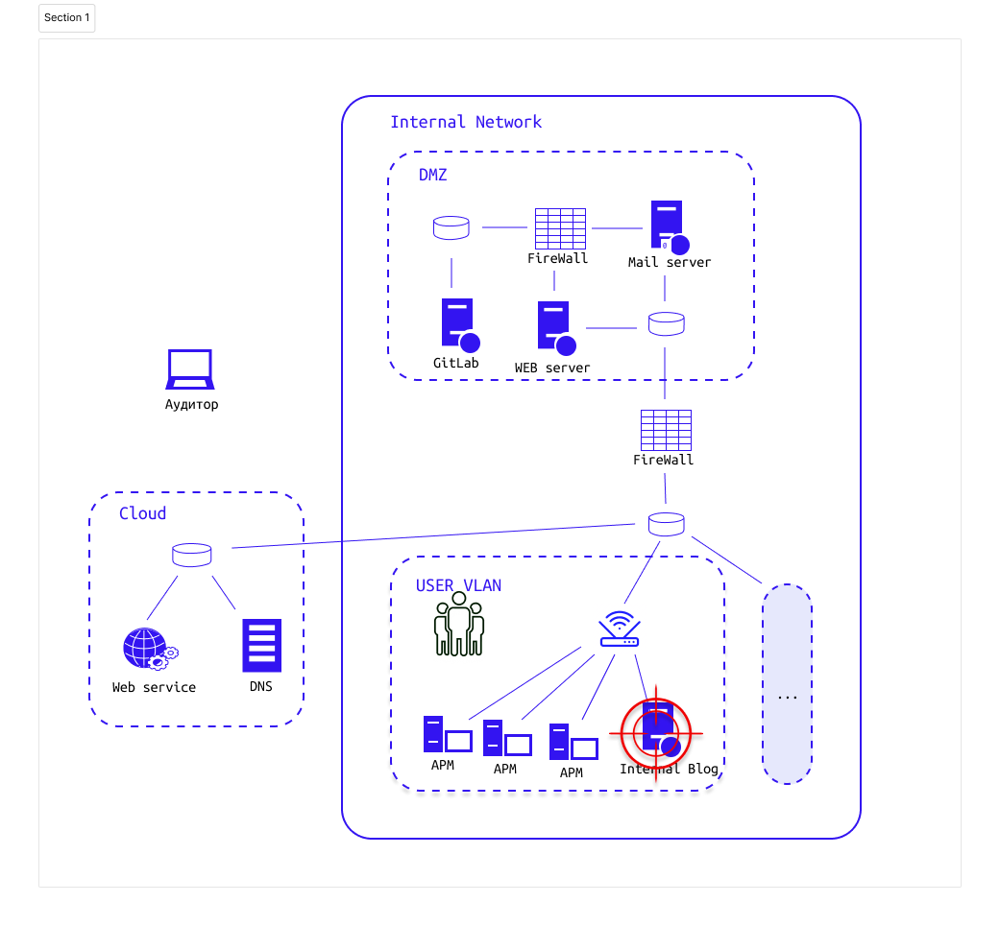

\newpage

# Задание 2.2.1 Компрометация сетевых сервисов (веб-приложений), возможная в результате ошибок конфигурации или разработки

### Основные понятия

1. **Веб-приложение (Web application)** —  клиент-серверное приложение, в котором клиент взаимодействует с веб-сервером при помощи браузера. Уязвимости веб-приложений возникают, когда разработчики допускают ошибки в коде. Это может происходить как на этапе разработки, так и на этапе доработки или исправления найденных ранее уязвимостей.  Также при разработке веб-сервиса может использоваться сторонний код, проверка которого требует отдельного внимания разработчиков. Существуют и другие причины небезопасных веб-приложений, некоторые из которых мы коснемся в курсе.
2. **Идентификация (Identification)** — это процедура определения и подтверждения субъекта идентификации (пользователя) через его идентификатор, однозначно определяющий его на основе предоставленных им данных, таких как имя, адрес электронной почты или номер телефона. Идентификация часто используется вместе с аутентификацией для подтверждения подлинности пользователя.
3. **Аутентификация (Authentication)** — это процедура проверки подлинности идентификационных данных пользователя, таких, как логин и пароль, чтобы убедиться, что он является тем, за кого себя выдает; по сути, процесс проверки конкретного пользователя или клиента путем сравнения введенного им пароля с паролем, сохраненным в базе данных.
4. **Авторизация (Authorization)** — это процесс проверки прав пользователя на выполнение определенных действий или доступ к определенным ресурсам системы. Пользователь может быть аутентифицирован, но не авторизован на выполнение определенной операции, если у него нет необходимых прав.
5. **Атака грубой силы (Brute force)** — это метод криптоанализа, при котором злоумышленник пытается взломать пароль или зашифрованные данные путем перебора возможных комбинаций до тех пор, пока не будет найдено правильное сочетание. Атака грубой силы может быть эффективной, если пароль короткий или используется слабый алгоритм шифрования, однако, при достаточной длине и сложности пароля, такая атака может занять слишком много времени или быть совсем неэффективной.
6. **Инъекция команд ОС (OS Command Injection)** (также известная как shell инъекция) — уязвимость веб-приложений, которая позволяет злоумышленнику выполнять произвольные команды операционной системы (ОС) на сервере, на котором запущено приложение, и, как правило, дает возможность полностью скомпрометировать приложение и все его данные.
	Очень часто злоумышленник может использовать уязвимость внедрения команд ОС для компрометации других частей инфраструктуры, используя доверительные отношения для перенаправления атаки на другие системы в организации.
7. **Контроль доступа (Access control)** — это процесс управления доступом пользователей к ресурсам системы, включая определение прав доступа и ограничений на использование ресурсов. Контроль доступа обеспечивает безопасность системы, ограничивая доступ пользователей только к необходимым ресурсам и операциям.
8. **Язык структурированных запросов SQL (Structured Query Language)** – это декларативный язык программирования для хранения и обработки информации в реляционной базе данных. Реляционная база данных хранит информацию в табличной форме со строками и столбцами, представляющими различные атрибуты данных и различные связи между значениями данных. Инструкции SQL можно использовать для хранения, обновления, удаления, поиска и извлечения информации из базы данных. Можно также использовать SQL для поддержания и оптимизации производительности базы данных.
9. **SQL-инъекция (SQL injection)** — это уязвимость веб-приложений, позволяющая злоумышленнику вмешиваться в запросы, которые приложение делает к своей базе данных. Она позволяет злоумышленнику просматривать данные, которые он, как правило, не может получить.
10. **Обратный путь в каталогах (Path Traversal)** (также известный как обход файловых путей) — это уязвимость веб-безопасности, позволяющая злоумышленнику читать произвольные файлы на сервере, на котором запущено приложение. Сюда могут входить код приложения и данные, учетные данные для внутренних систем и конфиденциальные файлы операционной системы.
11. **Недостаточная проверка доступа при запросе объекта (IDOR, Insecure Direct Object References)** — это уязвимость веб-безопасности, которая возникает, когда приложение предоставляет прямой доступ к объектам на основе ввода пользователя. Если приложение не проверяет наличие соответствующих разрешений у пользователя на выполнение операций с объектом, злоумышленник может манипулировать этими ссылками для доступа или модификации чужих данных. Это может включать доступ к конфиденциальной информации, такой как личные данные пользователей, документы, финансовые отчеты, и т.д. Уязвимость IDOR часто встречается в веб-приложениях, где объекты идентифицируются через URL или формы запросов, и может привести к серьезным нарушениям конфиденциальности и целостности данных.
12. **Расширяемый язык разметки (XML)** позволяет определять и хранить данные совместно используемым способом. XML поддерживает обмен информацией между компьютерными системами, такими, как веб-сайты, базы данных и сторонние приложения. Предопределенные правила упрощают передачу данных в виде XML-файлов по любой сети, поскольку получатель может использовать эти правила для точного и эффективного чтения данных.
13. **Инъекция внешних сущностей XML (также известная как XXE)** — это уязвимость веб-безопасности, позволяющая злоумышленнику вмешиваться в обработку XML-данных приложения. Часто она позволяет злоумышленнику просматривать файлы на файловой системе сервера приложений, а также взаимодействовать с любыми внутренними или внешними системами, к которым имеет доступ само приложение.
	В большом числе случаев злоумышленник может усилить атаку XXE для компрометации основного сервера или другой внутренней инфраструктуры, используя уязвимость XXE для выполнения атак на подделку запроса на стороне сервера (SSRF).
14. **Межсайтовый скриптинг (также известный как XSS)** — это уязвимость веб-безопасности, позволяющая злоумышленнику компрометировать взаимодействие пользователей с уязвимым приложением. Она позволяет злоумышленнику обходить политику одного источника (Same Origin Policy (SOP)), которая предназначена для разделения различных веб сайтов друг от друга.

# Наша цель в типовой инфраструктуре: 

Компрометация как можно большего числа сетевых сервисов (веб-приложений)

# Задание

> Story: Пентест не заканчивается на получении доступа к одному из векторов - ТД Wi-Fi, поэтому вам нужно исследовать и другие способы проникнуть во внутреннюю сеть компании.

Необходимо:
1. Скачать образ kali linux
2. 
3. 
4. Составить мини-отчет, где указать использованные подходы и затронутые угрозы безопасности. Отчет должен содержать название уязвимости, описание уязвимости, пример её эксплуатации, рекомендации к устранению

# Теоретические вопросы

1.
2.
3. 

## Доп. материалы:
