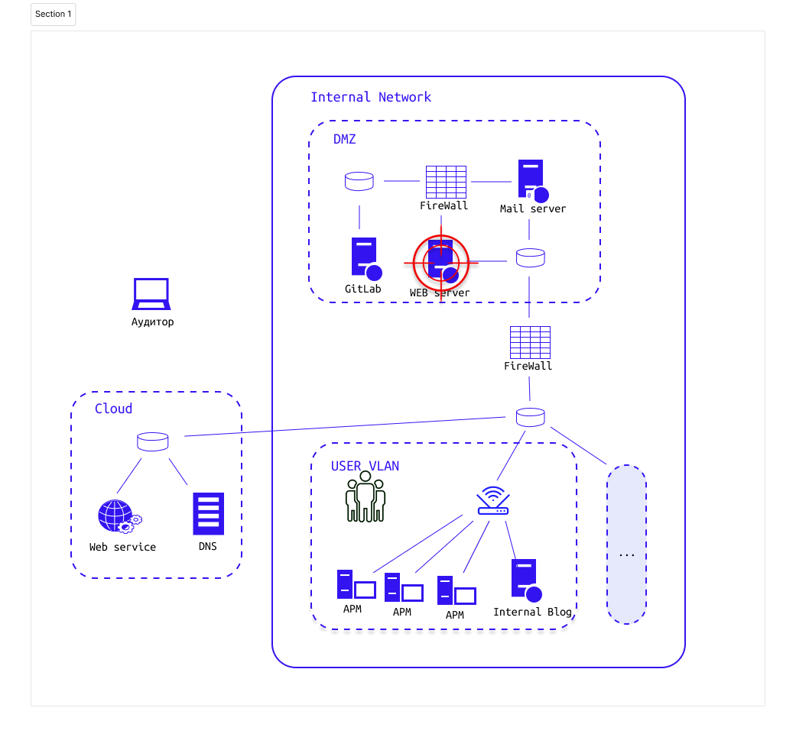

# Задание 2.2.2-4 Компрометация сетевых сервисов (веб-приложений), возможная в результате ошибок конфигурации или разработки

# Наша цель в типовой инфраструктуре: 

Компрометация как можно большего числа сетевых сервисов (веб-приложений)

# Задание

> Story:  

Необходимо:
1. Скачать образ kali linux
2. 
3. 
4. Составить мини-отчет, где указать использованные подходы и затронутые угрозы безопасности. Отчет должен содержать название уязвимости, описание уязвимости, пример её эксплуатации, рекомендации к устранению

# Теоретические вопросы

1.
2.
3. 

## Доп. материалы:
