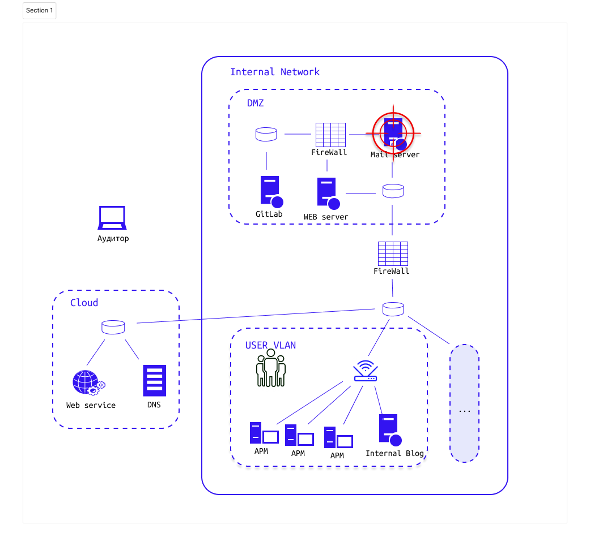

# Задание 2.3 Фишинг с применением методов социальной инженерии на персонал компании

Наша цель в типовой инфраструктуре - компрометация как можно большего числа сетевых сервисов (веб-приложений)

# Задание

> Story: 

Необходимо:
1. Скачать образ kali linux
2. 
3. 
4. Составить мини-отчет, где указать использованные подходы и затронутые угрозы безопасности. Отчет должен содержать название уязвимости, описание уязвимости, пример её эксплуатации, рекомендации к устранению

# Теоретические вопросы

1.
2.
3. 

## Доп. материалы:
