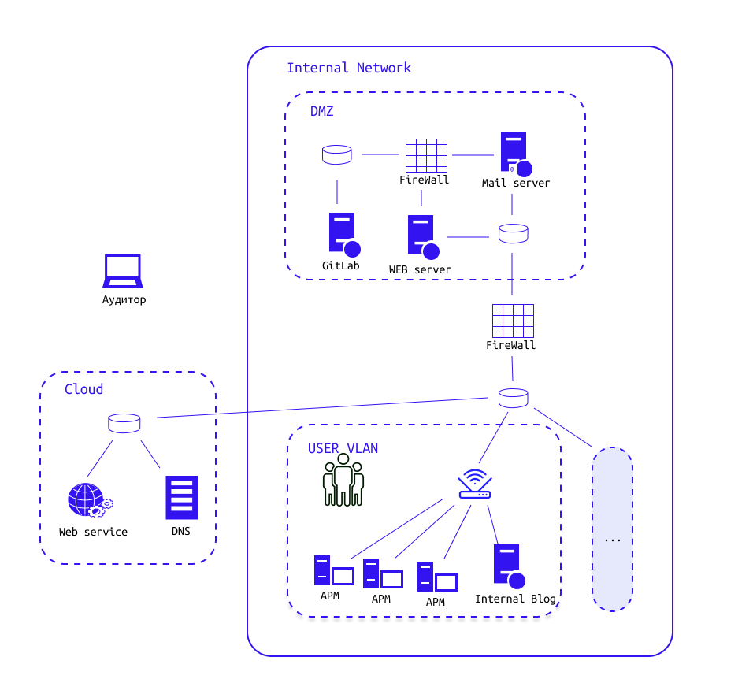

# Основы тестирования на проникновение. 

### Правовое регулирование действий белого хакера

Привиденная информация не является юридической консультацией. Описаны только общие принципы и нормы. Если вы сомневаетесь в правомерности своих действий лучше обратиться за соответствующей консультацией к юристам.

На момент написания курса в РФ нет принятых законов, явно регулирующих действия пентестеров, аудиторов или белых хакеров, поэтому надо знать и соблюдать большой комплект сопутствующих правовых актов. Также стоит отметить, что если затрагивается инфраструктура других стран (это могут быть как серверы, так и различные провайдеры услуг интернет), то нужно учитывать правовые нормы этих стран, а также нормы международного права. Помимо государственной регуляторики существует необязательная стандартизация, например добровольные системы сертификации по требованиям ISO 27001:2022 или отраслевые требования, например PCI DSS.

#### Нужно обязательно знать

- Понятие информационной безопасности тесно связано с законодательством и стандартизацией, регулирующими различные сферы деятельности. Существует множество регуляторов и требований, даже случайное нарушение функционирования некоторых систем или утечка конфиденциальной информации могут повлечь гигантские штрафы для владельца системы и нарушителя.
- Использование заражённого софта, не аккуратное открытие портов, изменение настроек сервисов или организация "закладок" могут способствовать проникновению настоящего злоумышленников в систему, а виновником инцидента окажитесь вы.
- Всегда надо учитывать требования к используемым программным продуктам в инфраструктуре заказчика, у большинства использование нелицензионного софта не допустимо.
- Не вся информация, к которой вы сумели получить доступ является открытой, а следовательно неправомерная работа с ней может подвести вас под статьи, вплоть до 272 УК РФ.
- Множество используемых белыми хакерами утилит попадают под определение "вредоносных компьютерных программ" и в случае заведения дела против вас вы также можете попасть под статью 273 УК РФ.

#### Постановление Пленума Верховного Суда РФ от 15.12.2022 N 37

Прямое трактование статей 28 главы в УК РФ фактически запрещает любую деятельность специалистов по анализу защищенности, приравнивая их к правонарушителям. Чтобы расширить возможности компаний по увеличению своей защищенности было выпущено Постановление Пленума Верховного Суда РФ от 15.12.2022 N 37. Оригинальный документ написан юридическим языком, но на vc.ru есть сильно упрощённая свободная трактовка c уклоном в нашу сферу. Самый важный для нас момент из этого постановления касается "вредоносных компьютерных программ" и находится в 11 пункте:

> Следует иметь в виду, что не образует состава преступления использование такой программы или информации лицом на принадлежащих ему компьютерных устройствах либо с согласия собственника компьютерного устройства, не преследующее цели неправомерного доступа к охраняемой законом компьютерной информации и не повлекшее несанкционированного уничтожения, блокирования, модификации, копирования компьютерной информации или нейтрализации средств ее защиты (например, в образовательных целях либо в ходе тестирования 6 компьютерных систем для проверки уязвимости средств защиты компьютерной информации, к которым у данного лица имеется правомерный доступ), равно как и создание подобных программ для указанных целей.

На основании этого пункта теперь специализированные утилиты можно хранить, разрабатывать и применять на своих ЭВМ (обучаться) и аккуратно применять по согласованию (на основе договора) с собственником на его информационных системах: важно случайно не попасть в чужие информационные системы (личные устройства сотрудников, подрядчиков, сервера провайдеров или поставщиков облачных услуг) или в необговорённые с собственником части его информационной инфраструктуры.

### Варианты деятельности белых хакеров

Белый хакер может работать как по подписанным договорам, так и без договора (на основании публичных политик компаний).

#### Работы по договору в компаниях специализирующихся на услугах ИБ

Это самый распространённый формат, в этом случае все юридические проволочки взаимодействия с заказчиком и определение фронта работ на себя берёт ваш работодатель, а за вами остаётся только выполнение задач в рамках договора с работодателем.
   
#### Работы по договору с владельцем информационных систем

В этом случае вы всегда составляете договор с владельцем информационных систем, где он явно прописывает, что разрешает вам делать с его системой, а что нет (важно случайно не выйти за пределы прописанной информационной системы).

#### Работы без явно подписанного договора

Наглядный пример — программы баг-баунти. Фактически это специальные соглашения (программы), опубликованные компаниями, которые разрешают проводить анализ защищённости некоторых сервисов компании (скоуп). Вы не имеете права разглашать найденные проблемы безопасности и эксплуатировать их для получения доступа к защищённой законом информацией, но можете сдать отчёт самой компании через специальную форму (с шансом получить вознаграждение, а иногда даже можно согласовать обнародование данного отчёта).

В каждой программе могут быть свои правила и ограничения, прежде чем приступать к работам, с ними нужно обязательно внимательно ознакомиться, а в случае сомнений задать владельцам программ вопросы через доступные каналы связи. Пример: программа "[Инфраструктура, веб-сервисы, мобильные приложения Яндекса](https://yandex.ru/bugbounty/i/main-scope)", и [общие правила](https://yandex.ru/bugbounty/i/rules) участия в программах от Яндекса.

В случае если программа опубликована на специальной платформе, то помимо правил, описанной в программе, нужно учитывать также и правила платформы. Примеры: Правила bugbounty.standoff365.com, а у bugbounty.bi.zone их можно скачать при регистрации.

### Примеры

- Вы нашли новый сканер уязвимостей и решили его проверить, указав в качестве цели первый попавшийся сайт пиццерии. Это нарушение законодательства, вы не заключили договор с компанией и не убедились в наличии у неё программы Bug Bounty.
- Вам попался PoC на уязвимость в популярном движке сайтов, вы скачали демо-сайт для этой платформы, запустили у себя в контейнере и проверили PoC на развёрнутом у себя сайте. Это допустимо, выполнено в учебных целях, использовалась только собственная вычислительная техника.
- Вы изучили как делаются атаки SQL-инъекций и решили потренироваться, для это на одной из платформ Bug Bounty нашли сайт, позволяющий писать статьи. Сайт входит в скоуп программы и вы создаёте черновик публикации с инъекцией. Вы пока не нарушили законы, т.к. компания публично разрешила проверять её безопасность.
- Вы узнали, что одна из популярных CMS кроме обычной административной панели также имеет расширенную, на нестандартных портах. Вы заказали дешевый VPS с автоустановкой на него указанной CMS, и следом через nmap запустили сканирование портов на ip-адресе VPS. Скорее всего вы нарушили законодательство, т.к. не получили разрешения у хостера, а большинство не имеют явного разрешения на сканирование их серверов.

#### Терминология:

- **Тестирование на проникновение (жарг. Пентест или Пентестинг)** — метод оценки безопасности компьютерных систем или сетей средствами моделирования атаки злоумышленника. Процесс включает в себя активный анализ системы на наличие потенциальных уязвимостей, которые могут спровоцировать некорректную работу целевой системы, либо полный отказ в обслуживании. Анализ ведётся с позиции потенциального атакующего и может включать в себя активное использование уязвимостей системы. Результатом работы является отчёт, который содержит в себе все найденные уязвимости системы безопасности, а также может содержать рекомендации по их устранению. 
- **Аудитор или Пентестер (также: Белый хакер)** – это специалист, проводящий испытание на проникновение с целью демонстрации возможности компрометации информационной системы и оценки возможности ее осуществления.
- **Техника** — это способ решения конкретной технической задачи, при помощи инструментов одного типа действия.

#### Главное, что мы должны помнить:

Цель белого хакера – продемонстрировать возможности потенциального злоумышленника по компрометации информационной системы и выявив все возможности компрометации (угрозы, уязвимости, недостатки), передать их владельцу исследуемой системы для устранения угроз и повышения защищенности системы в конечном итоге.

Именно повышение защищенности информационных систем является результатом работы белого хакера.

### Этапы проведения атак и компрометации информационных систем

Общий набор этапов для проведения атак и успешной компрометации произвольной информационной системы:

Выше представлена общеизвестная модель Cyber Kill Chain Lockheed Martin, первая универсальная модель описывающая компьютерную атаку верхнеуровневым набором действий для компрометации какой-либо информационной системы или целой инфраструктуры. Рассмотрим каждый из его процессов:

- **Reconnaissance (англ. Разведка)** — это процесс сбора информации об инфраструктуре и уязвимостях компании, который выполняют, чтобы определить, какие действия могут быть выполнены для ее компрометации.
- **Weaponization (англ. Вооружение)** — это процесс создания и подготовки действующим лицом программного обеспечения и инструментов, которое может использоваться для атаки на инфраструктуру компании.
- **Delivery (англ. Доставка)** — это процесс доставки программного обеспечения на устройства в сети компании.
- **Exploitation (англ. Эксплуатация)** — это процесс использования уязвимостей в инфраструктуре компании, обнаруженных на этапе разведки, для получения несанкционированного доступа.
- **Installation (англ. Установка)** — это процесс установки вредоносного программного обеспечения на компьютеры или серверы в сети компании для закрепления полученного доступа в системе.
- **Command and control (англ. Командование и контроль)** — это процесс установки соединения между скомпрометированным компьютером и управляющим им ПО, и сервером действующего лица, который дает лицу возможность удаленно управлять компьютером.
- **Actions on objective (англ. Действия по достижению цели)** — это процесс выполнения действующим лицом своих целей, которые могут включать выполнение таких недопустимых для организации событий как: кражу данных, шпионаж, вредоносные действия и другие действия, которые могут нанести ущерб инфраструктуре компании.

### Типовая инфраструктура компании

Рассмотрим схему типовой инфраструктуры организации, которая может подвергаться атакам. На примере подобной инфраструктуры мы будем изучать, какой путь проходят хакеры в целом и белые хакеры при имитации атак.

### Этапы, которые проходит аудитор для достижения цели:

1. **Разведка во внешней сети. Поиск ресурсов организации**
   1. Пассивный - Поиск чувствительных данных компании (OSINT)
   2. Активный - Анализ доменных имен
2. **Атаки первичного доступа**
   1. Атаки на внутреннюю сеть, Wi-Fi точки доступа
   2. Компрометация сетевых сервисов (веб-приложений), возможная в результате ошибок конфигурации или разработки
      - Эксплуатация уязвимости (CVE) при помощи фреймворка
      - Уязвимость IDOR
      - Уязвимость обхода аутентификации
      - Уязвимость SQL-инъекции
      - Уязвимость инъекции команд ОС
   3. Фишинг с применением методов социальной инженерии на персонал компании
3. В конце необходимо **сформировать отчет** о проделанных работах и предоставить преподавателю

© Вдохновением стал бесплатный и открытый [курс CyberEd](https://stepik.org/course/169003)
